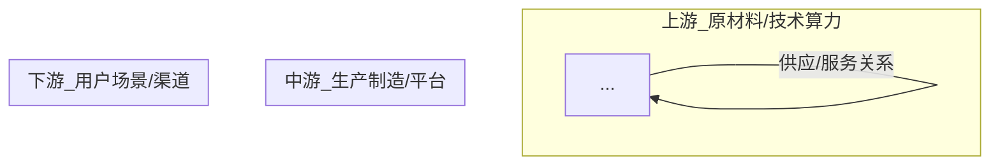

# quant-risk — 全生命周期风控 Skill

## 项目定位

Codex Skill，覆盖 **美股 + A 股 + 港股** 全生命周期风控：投前审查 → 持仓监控 → 预警触发 → 处置决策。

## 核心约定

- **Python 包管理**: 用 `uv add` 不用 pip
- **执行 Python**: 用 `uv run`
- **记忆系统**: AgentMemory（行为记忆） + OpenKnowledge（文档知识）双轨制
- **数据分析方法**: 二维评分 → 总得分 100 分。基本面 60 分(60%权重) + 技术面 40 分(40%权重)。技术面由两个子分组成：热点(原始分×4) + 缠论(原始分×4)，各 1-5 分，合计 8~40 分。投资理念：**基本面为主、技术面为辅、结合当前热点**。
- **基本面评分六维评分系统（2026-07-22 重构）**：基本面评分拆分为 6 个独立维度，各自在池内做百分位排名后等权求和。📊 生意质量(段永平) → 毛利率/净利率/ROE，🔒 护城河(巴菲特) → ROE/毛利率/股息率/负债率，👔 管理层(段永平+巴菲特) → ROE/净利率/营收增速/负债率，⚠️ 最大风险(芒格) → 负债率/营收增速/净利增速，🌍 文明趋势(李录) → 营收增速/净利率/负债率/ROE，💰 估值(巴菲特+段永平) → PE相对估值/股息率。每个维度满分 10 分，6 维求和得基本面总分 60 分。每维度输出：分+结论+信心度(★)。
- **📌 投资理念铁律（2026-07-21 用户明确）**：**基本面为主、技术面为辅、结合当前热点**。代码实现和所有分析必须严格贯彻此优先级——基本面权重最大(60%)且是入场决策的第一筛选条件，技术面（热点+缠论合并）仅作为择时参考(40%)。**任何时候都不能只看技术面买入，基本面不合格的标的必须一票否决。** 评分阈值（≥70强烈关注）已经体现了"基本面好+技术面好"双高共振才强烈推荐的逻辑。
- **📊 一图胜千言（2026-07-23 新增）**：所有分析报告优先使用 Mermaid 图而非纯表格。目前包含 4 种 Mermaid 图类型：
  - **产业链全景图（流程图+子图）**：上中下游子图+竞争格局+核心财务数据，边框颜色区分层级（蓝=上游、橙=中游、绿=下游、粉=竞争、紫=财务）
  - **大师辩论（时序图）**：5 参与者（段永平/巴菲特/芒格/李录/系统），每个维度 6 步骤 2 轮辩论，`Note over` 分隔维度，数据源标注在节点中
  - **一票否决（时序图）**：4 参与者（漏斗/逆向/镜子/结论），逐项检查后汇总结论
  - **技术面/情绪面（流程图）**：4 个子图展示趋势/缠论/量价/支撑或新闻/机构/资金/板块，每条数据标注数据源
  - 图的目的是减少文字阅读负担，表格只作为补充，Mermaid 图类型按数据特性选择（流程图展示结构、时序图展示流程、Journey 图展示评分）
- **金融数据精度工具 (`scripts/financial_rigor.py`)**：借鉴 ai-berkshire 的金融严谨性工具，提供市值验算（股价×总股本 vs 报告市值）、估值指标精确验算（PE/PB/ROE/FCF Yield）、多源交叉验证（N个来源自动比对，>1%标记）。所有计算使用 Python `decimal.Decimal`（精确十进制），非 `float`（浮点近似）。
- **芒格式逆向检验**：在 `_raw_score_one` 中生成"这家公司可能怎么死"的逆向风险分析，基于负债率/营收增速/净利/ROE/毛利率等指标列出失败路径，呈现在详情块的"芒格式逆向检验"段落。
- **镜子测试**：在详情块末尾自动生成"5句话说清楚为什么买"，基于 ROE/PE/负债率/止损等数据逐句构建。≥5句通过，3-4句边缘，<3句未通过。贯彻"说不清楚不买"原则。
- **留白原则**：C级信息丰富度的标的，评分建议降一档（强烈关注→可关注），且输出追加留白声明"数据严重不足，置信度较低"。
- **双重舍入链修复**：`percentile_score_all` 中评分计算改为先保留精确值再一次性舍入，消减约 0.2-0.3 分累积误差，消除 69.5→70.0 边界误判。
- **ai-berkshire 项目引用**：本项目借鉴了 [ai-berkshire](https://github.com/xbtlin/ai-berkshire) 的以下 SOP：
  - **六维评分框架**：生意质量(段永平)、护城河(巴菲特)、管理层(段永平+巴菲特)、最大风险(芒格)、文明趋势(李录)、估值(巴菲特+段永平)
  - **行业研究 SOP** (`industry-research.md`)：产业链全景图、全球扫描、文明趋势判断
  - **行业漏斗筛选 SOP** (`industry-funnel.md`)：四层漏斗、5条硬指标、AI偏见自查
  - **芒格式逆向检验**：公司级+行业级风险分析
  - **镜子测试**：5句话说清楚为什么买
## 📋 输出格式铁律（已固化，直接执行，不必再查知识库）

以下规则经过反复踩坑后固化，是 quant-risk 项目的最高优先级行为规范，所有会话必须遵守。

### ⛔ 规则一：脚本输出原样展示，严禁追加手写内容

- 脚本输出的报告必须**原样展示**，严禁在末尾追加手写表格或自定义分析
- 所有格式统一由脚本的 formatter（`formatter.py` / `formatters/`）控制，改格式只改文件不改输出
- 需要补充分析时，放在脚本输出之后并用 `---` 分隔线隔开，且必须写明"以下为补充说明"

### 📌 规则二：脚本粘贴强制检查（反复踩坑）

执行脚本后，**第一步必须把 Bash/工具返回的脚本完整输出逐字复制到回复正文中**，不能只写"脚本输出完毕"就跳过。

反复出现的错误：模型拿到了工具结果但在 compose 回复时忘了粘贴，直接跳到补充说明。

**写回复前强制自问**：工具返回的每一行内容都贴到正文里了吗？确认后再发送。

### ⛔ 规则三：脚本输出绝不加 ``` 代码块（反复踩坑多次）

脚本输出本身是 markdown（含 `|` 表格），**直接粘贴到回复正文**，绝不能包在 ``` 代码块里——加了代码块表格就会变成纯文本，渲染不出来。

**写回复前强制自检**：
- 脚本输出有没有被包在 ``` 里？→ 如果有，去掉！
- 表格行有没有 `|` 分隔符？→ 应该有，在正文中直接渲染

### 🏷️ 规则四：LLM 补充分析必须标注数据来源

在 `---` 分隔线之后的"补充说明"中，**必须标明每条信息来源**。读者必须能区分哪些是原始数据、哪些是 LLM 的二次解读、哪些是外部检索补充的内容。

| 数据来源 | 标注格式 | 适用场景 |
|---------|---------|---------|
| 基于脚本输出的解读 | `> 📡 数据来源: 基于脚本输出解读` | 对四张表的数字做趋势判断、对比分析 |
| web_search 联网检索 | `> 📡 数据来源: web_search [URL]` | 补充市占率、研报评级、行业景气度等脚本之外的数据 |
| 多源混合 | 每条内容单独标注 | 脚本输出 + web_search 拼在一起写 |

**正确示例**：
```
---

## 以下为补充说明

> 📡 数据来源: 基于脚本输出解读

**技术面判断**：RSI14 仅 38.94，说明反弹动能不足；布林中轨 70.37 是短期压力位。

> 📡 数据来源: web_search https://www.xxx.com/report

**行业背景**：MDI 价格处于近3年40%分位，行业景气度回暖。
```

### ✅ 规则五：脚本输出展示标准流程（反复踩坑后固化）

脚本输出必须通过 **文件落地 + Read 工具读取** 的方式展示，**禁止依赖 Bash 工具返回的 stdout 直接粘贴**（Bash 输出在某些视图下不可见）。

标准三步流程（**新会话也必须遵守，不可跳过**）：

1. **执行落地**：`uv run scripts/analyze.py <code> > /tmp/report.md 2>&1`
2. **Read 展示**：用 Read 工具读取 `/tmp/report.md` 显示完整内容
3. **补充说明**：在 `---` 分隔线后追加 LLM 补充说明

### 🔍 规则六：外部数据验证铁律（2026-07-17 新增）

**严禁用训练记忆数据充当事实输出。** 股票分析和推荐涉及外部事实性数据时，必须通过联网验证。

**适用范围**：
- 行业市占率、产能数据、全球排名
- 券商研报目标价、评级、盈利预测
- 财务指标的具体数值（季度营收/净利/ROE 等）
- 行业景气度、价格分位、供需平衡
- 公司战略、业务结构、技术壁垒等定性描述

**执行规则**：
1. **脚本输出**（analyze.py / recommend.py）→ 原样展示，不受影响
2. **补充说明中的事实性数据** → 必须用 web_search 或 extract 验证后再写
3. **某数据无法验证** → 明确标注"数据待验证，来源未确认"，严禁凭空填写
4. **仅凭逻辑推断的合理结论**（如"PE 偏低说明估值修复空间"）→ 可以写，因为这是分析方法不是事实数据

### ⚡ 规则七：输出风格偏好（2026-07-23 用户明确）

**这是硬性行为规范，每次输出必须遵守。**

| 偏好 | 说明 | 禁止的写法 | 正确的写法 |
|------|------|-----------|-----------|
| **强制给结论** | 每项分析必须给明确结论，不能含糊 | "可适当关注""值得关注" | 🔴止损 / 🟢买入 / 🟡持有 / 🟢加仓 |
| **不怕冲突** | 大师视角对抗要尖锐，质疑和答辩要直接冲突 | "各有道理""双方都有可取之处" | 一方明确驳斥另一方，给出明确胜负 |
| **数据诚实** | 缺失数据直接说"数据缺失"，不要胡编 | "无数据""暂无""—" | **数据缺失** |

**核心原则**：
- 不要怕和 LLM 吵架，用户就想看 LLM 吵架
- 如果缺失数据，就说"数据缺失"，不要编造"暂无"、"—"等模糊占位符
- 每项分析必须给可操作的结论（买/卖/持有/止损），不能只给"可关注"

**评分扣分可见（2026-07-23 新增）**：六维评分表中，若维度因大师质疑被扣分，评分列显示 `X.X/10 ↓-0.5`，扣分原因追加到大师视角列（`⚠️ 扣分原因：...`）。大师答疑列以 `✅质疑成立，评分已扣减` 或 `❌质疑不成立，评分不受影响` 开头，给出明确结论。

## 用户持仓读取顺序

当需要获取用户持仓信息时，按以下优先级依次查找，找到即停：

1. **当前会话上下文** — 用户在本轮对话中已提及的持仓
2. **AgentMemory** — 通过 `memory_recall` 查询关键词 `portfolio` / `持仓` / `holding`，**查询方法详见知识库** `/Users/xiazhicheng/project/llm_wiki/articles/agentmemory-mcp-query-method.md`
3. **询问用户** — 以上均无数据时，要求用户自行提供持仓信息

> 🗂️ **持仓数据仅存储在 AgentMemory 中，不保存本地文件**，不再有 `portfolio.json`。
> `portfolio_report.py` 通过 `--stdin` 参数接收持仓 JSON，AI 从 AgentMemory 取出后通过管道传入。

## 用户持仓自动保存规则

**触发时机**（满足任一即执行保存）：

1. **用户主动提供或更新持仓信息时** — 用户明确说出"我的持仓是..."、"买入/卖出了XX"等
2. **持仓诊断/风控分析完成后** — 分析结果涉及持仓变动建议时
3. **会话结束时** — 本会话中持仓信息发生过变更

**保存操作（写入 AgentMemory）：**

通过 `memory_save`，参数：
   - `content`: 完整的持仓 JSON 内容（账户总览 + 各标的明细）
   - `type`: `"preference"`
   - `concepts`: `["portfolio", "持仓", user_name, ...]`

**注意：** 不要等待用户说"保存"才执行。上述触发时机到来时，自动执行保存。

## 🚀 一句话投资建议工作流（2026-07-22 固化）

用户只需说 **"给我投资建议"**（或类似的一句话），自动触发完整分析流程：

**步骤 1 — 获取持仓**
- 按「用户持仓读取顺序」查找持仓
- 有持仓 → 跳转步骤 2
- 无持仓 → 请用户手动输入或上传截图

**步骤 2 — 获取最新行情**
- 调用 `hk_stock_quote_tencent_async` 获取各标的最新价（无需更新本地文件）

**步骤 3 — 运行组合完整报告**
- 从 AgentMemory 取出持仓 JSON，通过 stdin 传入：
  `echo '{"holdings":[...]}' | uv run scripts/portfolio_report.py --stdin`
- 输出：组合总览 → 产业链Mermaid → 四大师 → 行业漏斗 → 芒格式风险 → 缠论 → 镜子测试 → AI偏见自查

**步骤 4 — 运行新标的推荐**
- `uv run scripts/recommend.py`
- 输出 TOP10 推荐标的 + 四大师评分 + 定价择时

**步骤 5 — 汇总结论（输出格式固定，禁止自由发挥）**

按以下固定模板输出，**每部分必须存在**，不跳过任何区块。没有持仓需要诊断时跳过第一部分，没有可释放资金时跳过推荐表格只写"无可用换仓资金"。

---

### 📋 投资建议报告（固定模板）

#### 第一部分：组合诊断

**组合总览**

| 指标 | 值 |
|:----|:---|
| 总投入 | XXXX HKD |
| 当前市值 | XXXX HKD |
| 总盈亏 | XX.XX%（XXXX HKD）|
| 持仓数 | X 只 |
| 集中度 TOP1 | 名称 XX.XX% ⚠️（超/未超50%红线）|
| 组合健康度 | ★★☆☆☆ X.X/5 |

**各股操作建议**

按以下结构逐只输出，**六维评分用定性结论+信心度格式（不列分数和计算链），技术面结构化三行**。

-----

**标的名称**（代码）— 成本 X.XX → 现价 X.XX | 盈亏 -X.XX%（-XXX HKD）| 仓位 XX.XX%

📊 **六维评分**（总分 XX/60）— 评分由脚本计算，定性结论由 LLM+web_search 补充

| 维度 | 评分 | 信心度 |
|:----|:---:|:------:|
| 生意质量（段永平） | X.X/10 | ★★☆☆☆ |
| 护城河（巴菲特） | X.X/10 | ★★★☆☆ |
| 管理层（段永平+巴菲特） | X.X/10 | ★★★☆☆ |
| 最大风险（芒格） | X.X/10 | ★★★☆☆ |
| 文明趋势（李录） | X.X/10 | ★★★☆☆ |
| 估值（巴菲特+段永平） | X.X/10 | ★★★☆☆ |

🔧 **产业链全景图**


> 卡脖子: 关键制约因素
> 竞品对标: 与行业龙头差距

🔧 **技术面分析**

**① 周线大势**

| 指标 | 数据 |
|:----|:----|
| MA60 | XX.XX，偏离+X.XX% 🔴偏空/🟢偏多 |
| 缠论判定 | 有/无中枢，笔X，方向 ↑/↓ |

**② 日线走势**

| 指标 | 数据 |
|:----|:----|
| 走势类型 | 单中枢盘整/无中枢单边上涨/下跌 |
| 笔/段/中枢 | 笔X 段X 中枢X |
| 最近笔 | ↑/↓ YYYY-MM-DD~YYYY-MM-DD [XX.XX→XX.XX] |
| 中枢区间 | ZG=XX.XX ZD=XX.XX ZZ=XX.XX，价格在内部/上方/下方 |

**③ 关键信号**

| 维度 | 信号 | 数值 |
|:----|:----|:----:|
| MA排列 | 偏多/偏空/中性 | MA5=XX MA10=XX MA20=XX MA60=XX |
| MACD | 多头✅/空头❌ | DIF=XX DEA=XX 柱=XX |
| 缠论买卖点 | 一买/二买/三买/无 | 底分型=XX(日期) 顶分型=XX(日期) |
| 背驰信号 | 顶背驰/底背驰/无 | 强/弱 |
| 风控 | 止损-X.XX% | 止损 XX.XX / 止盈 XX.XX |

**行业漏斗**

| 指标 | 问题 | 值 | 通过 |
|:----|:----|:---:|:----:|
| PE合理 | 估值贵不贵？ | XX | ✅ |
| ROE>15% | 资本回报高不高？ | XX% | ✅/❌ |
| 营收正增长 | 主业在扩张吗？ | XX% | ✅/❌ |
| 净利正增长 | 赚钱变多了吗？ | XX% | ✅/❌ |
| 负债率<60% | 杠杆风险大吗？ | XX% | ✅/❌ |
| 竞对对比 | 优势>劣势？ | 主要竞对+优势劣势摘要 | ✅/❌ |

> 结果: ✅通过（X/6）/ ❌不通过（X/6）

**镜子测试** → ⚠️ 边缘（3/5）/ ✅通过（5/5）/ ❌未通过（<3/5）

| # | 问题 | 回答 |
|:-:|:----|:----|
| ① | 这门生意我能理解吗？ | 业务描述（web_search），结论：我理解它/在能力圈边缘/看不懂 |
| ② | 护城河深不深？ | 护城河描述（web_search），结论：宽阔且在变宽/一般/不明显 |
| ③ | 管理层值得信任吗？ | 创始人/CEO（web_search）+ 营收数据，结论：值得信赖/一般/存疑 |
| ④ | 价格有安全边际吗？ | PE Xx + 六维估值评分，结论：有安全边际/一般/估值偏高 |
| ⑤ | 错了会怎样？ | 具体下行风险，结论：可控/需设止损/风险极高不建议买入 |

> 说不完整=不买，没有例外。

**操作建议**: ✅持有 / 🔴止损 / 🟡减仓 / 🟢加仓

-----

（第二只标的重复相同结构）

#### 第二部分：换仓方向

**推荐标的 TOP5**（如有可释放资金）

| 排名 | 标的 | 总分 | 核心亮点（一句话） | 入场区间 | 止损 |
|:---:|:----|:---:|:-----------------|:--------:|:----:|
| ⭐1 | 名称 | XX.X | ROE XX%/营收+XX%/PE XXx | X.XX | X.XX |
| ⭐2 | 名称 | XX.X | ROE XX%/营收+XX%/PE XXx | X.XX | X.XX |
| ⭐3 | 名称 | XX.X | ROE XX%/营收+XX%/PE XXx | X.XX | X.XX |
| ⭐4 | 名称 | XX.X | ROE XX%/营收+XX%/PE XXx | X.XX | X.XX |
| ⭐5 | 名称 | XX.X | ROE XX%/营收+XX%/PE XXx | X.XX | X.XX |

> 无可用换仓资金时，此行写：**无可释放资金，当前无换仓需求**

#### 第三部分：关键提醒

- 必填项1（如某标的的风险提示）
- 必填项2（如板块趋势观察）
- 必填项3（如多源数据交叉验证，**必须列出具体标的+指标+偏差率**，如"02698乐舒适 ROE腾讯19% vs Yahoo31%，偏差64%"）

---

> 📡 数据来源: scripts/portfolio_report.py + scripts/recommend.py 输出
> ⚠️ 声明：基于公开市场数据，不构成投资建议

---

**模板使用铁律**：
1. 每部分标题、表格列名、顺序**完全一致**，不能增删改列
2. 表格内容填脚本输出的实际值，没有值写"暂无"
3. 无持仓需要诊断时跳过第一部分，直接输出"当前无持仓"
4. 无可换仓资金时，推荐表格位置写"无可释放资金，当前无换仓需求"
5. 补充说明可以追加在 `---` 分隔线之后

- 保存本次持仓信息到 AgentMemory

## 架构速览 (V1.8.0)

所有代码统一在 `scripts/` 目录下，`quantrisk` 作为 `scripts/quantrisk/` 子包存在。

```
scripts/
├── analyze.py               统一多市场分析脚本
├── recommend.py             统一推荐脚本入口
├── portfolio.py             持仓诊断工具
├── portfolio_report.py      持仓完整报告（产业链Mermaid+四大师+缠论+行业漏斗）🔥
├── tech_chan.py             缠论深度分析 + 产业链Mermaid输出 🔥
├── chan_mtf.py              缠论多周期联立分析
├── formatter.py             选股推荐格式化器 (Pydantic + 渲染)
├── formatters/              四阶段风控格式化器
│   ├── __init__.py
│   ├── _base.py             共享: FormatValidationError + 校验/渲染工具
│   ├── _pretrade.py         投前审查: format_pretrade()
│   ├── _holding.py          持仓监控: format_holding()
│   ├── _alert.py            预警触发: format_alert()
│   └── _disposal.py         处置决策: format_disposal()
└── quantrisk/               Python 模块（scripts/quantrisk 子包）
    ├── __init__.py          包入口
    ├── recommender.py       共享过滤/评分引擎
    ├── recommend_hk.py      港股选股推荐适配器
    ├── recommend_cn.py      A股选股推荐适配器
    ├── recommend_us.py      美股选股推荐适配器
    ├── data.py              数据层 — 行情/K线/基本面/资金面/信号/公告/期权/SEC/工具 + TickFlow
    ├── chan.py              缠论 — 分型→笔→线段→中枢→背驰→买卖点
    ├── indicators.py        技术指标 — MA/MACD/RSI/KDJ/BOLL + 缠论 re-export
	    ├── screener.py          标的池筛选 + 批量查询
	    └── report.py            StockAnalyzer 一键全量分析入口
```

## 数据源优先级

| 数据类型 | 主源 | 备选 | 备注 |
|---------|------|------|------|
| A股行情 | 腾讯(不封IP) | 东财 push2 | — |
| A股日K | 腾讯(前复权) | 百度(带MA) / mootdx / TickFlow | — |
| 港股行情 | 腾讯(78字段) | 新浪(25字段) | — |
| 港股日K | Yahoo | **TickFlow**(备选) | Yahoo港股经常缺数据 |
| 美股行情 | 腾讯(71字段) | 新浪(36字段) | — |
| 美股日K | 新浪 / Yahoo | TickFlow(备选) | — |
| 基本面(港股A股) | 东财 datacenter | Yahoo(key stats) | — |
| 基本面(美股) | Yahoo | — | — |
| 缠论K线 | Yahoo / 腾讯 / 新浪 | **TickFlow**(数据最全) | TickFlow支持前复权 |

**TickFlow** (免费免注册): 官方 SDK `pip install tickflow`，`TickFlow.free()` 模式
- 免费提供历史日K/周K/月K/季K/年K，无需 API Key
- 支持 A股(`.SH`/`.SZ`/`.BJ`) + 港股(`.HK`) + 美股(`.US`)
- 支持前复权 (`adjust=True`)
- 不支持实时行情和分钟级K线（free模式）
- 文档: https://docs.tickflow.org

## 关键设计决策

- **代码从 SKILL.md 提取为 Python 模块**: V1.2.0 将之前散落在 SKILL.md 文本中的函数正式提取为可导入的 Python 包。V1.6.0 进一步重构评分系统为 100 分制、增加基本面 debug 明细、选股→定价→择时三段式输出、持仓择时判断。
- **所有代码统一在 scripts/ 目录**: 脚本入口 `scripts/*.py`，Python 模块 `scripts/quantrisk/*.py`，不再保留顶层 `quantrisk/` 目录
- **data.py 四合一**: HTTP 会话管理 + 行情层(8函数) + K线层(6函数) + 基本面/资金面/信号等(30函数)合并为一个文件，GitHub 浏览一目了然
- **scripts/ 入口**: 可直接 `uv run scripts/analyze.py 03690` 运行，无需 pip install
- **A股行情主力**: 腾讯 (不封IP) > 东财 push2
- **A股日K**: 腾讯 (前复权) > 百度 (带MA) / mootdx (多周期)
- **缠论背驰**: MACD面积对比, 阈值15%, 强背驰50%
- **缠论中枢**: 至少3段重叠 (min_overlap=3)
- **标准化笔**: 分型间距≥4根K线, 同向取极端值
- **数据获取**: 全部 aiohttp 异步, batch_*() 并行查询
- **标的池筛选**: 四层流程：①宏观扫描(板块排名→候选池) → ②中观过滤(市值/股价硬约束) → ③基本面一票否决(营收< -30%或净利< -30%或PE严重负值直接淘汰，贯彻"基本面为主") → ④微观评分(基本面×12+热点×4+缠论×4，满分100)
- **评分系统 V3（2026-07-22 重构，四大师视角）**:
  - 借鉴 ai-berkshire 的"四大师视角对抗"框架，基本面评分拆分为 4 个独立子维度
  - 段永平(商业模式)30%：毛利率/净利率/ROE，判断"这是对的生意吗？"
  - 巴菲特(护城河/估值)30%：PE相对估值/PB/股息率/ROE，判断"够便宜吗？有安全边际吗？"
  - 芒格(逆向风险)20%：负债率/营收增速(负值重扣)/净利同比(负值重扣)，判断"怎么会死？"
  - 李录(长期确定性)20%：营收增速/净利率/负债率/股息率/ROE，判断"10年后还在吗？"
  - 每个子分独立评分（基础分 2.0，范围 1~5），各自在池内做百分位排名
  - 加权合成：`fb_pct = dyp_pct×30% + buffett_pct×30% + munger_pct×20% + lilu_pct×20%`
  - 映射公式：`fb = 1 + fb_pct×4`，`fb_w = round(fb×12, 1)`，满分 60
  - 百分位排名在未 clamp 的原始分上操作，扩大区分度
  - 独立裁决：基于百分位评分映射为 ✅ 通过(≥4.0) / ⚠️ 有条件通过(≥3.0) / ❓ 灰色地带(≥2.0) / ❌ 不通过(<2.0)
  - 投票制合成：4/4 通过→强烈推荐，3/4→推荐，2/4→灰色地带，1/4→不推荐，0/4→回避
  - 每个大师配有独立追问文本（基于原始指标生成定性分析），如"毛利率X%远超60%，有极强的定价权"
  - 信息丰富度评级：A级(7-9字段有值)/B级(4-6字段)/C级(<4字段)，标注在报告中
  - 基本面一票否决扩展为 8 条：新增负债率>90%/ROE<0/毛利率<10%且营收<0/PB<0/营收<净利
- **基本面一票否决（2026-07-20 新增）**：
  - 在评分之前增加 `fundamental_veto()` 关卡，严重基本面恶化的标的不进评分池
  - 否决条件：营收同比<-30% 或 净利同比<-30% 或 PE<-10（严重亏损）
  - 否决记录在报告中"②.5 基本面一票否决"段落独立展示
  - 贯彻"基本面为主"理念：技术面和热点再强，基本面崩塌的股票也不推荐
- **输出格式「四大师视角对抗 + 选股→定价→择时」三段式（2026-07-22 重构为四大师框架）**:
  - 第一步：选股（全市场扫描→中观过滤→TOP10 排名→各股四大师评分明细）
  - 第二步：定价（入场区间→止损→目标价→综合建议表）
  - 第三步：择时（四大师背景摘要 + 推荐标的买入时机 + **持仓卖出判断**）
  - 各股分析块以**四大师视角对抗**为中心：展示四大师评分表（含计算明细链如 `基础2.0+毛利率35.9%(>20%→0)+...`），并自动生成对抗分析文本（如"好生意≠好价格"、"长期vs短期的视角冲突"）
  - 满分 100 分，TOP10 表列名：`🏢四大师(60分) | 技术面(40分)`
- **持仓卖出判断（2026-07-20 新增）**:
  - 当用户提供持仓信息后，择时步骤自动分析每只持仓的卖出时机
  - 输出格式：持有/减仓/卖出/加仓 + 具体理由（MA排列/MACD/资金流向）
  - 数据格式：`format_output(data, market)` 的 data 中传入 `portfolio_timing` 列表
  - 详见 `formatter.py` 的 `PortfolioTimingItem` 模型和 `_render_portfolio_timing()` 函数
- **缠论深度分析嵌入推荐模板（2026-07-21 新增）**:
  - 推荐报告的缠论部分从简略摘要升级为**周线大势 + 日K买卖点 + 笔结构**三层深度分析
  - **周线定大势**：从腾讯获取周K数据，计算周线MA60状态和缠论判定（偏多/中性/偏空）
  - **日K定买卖点**：从 `chan_risk_assessment` 提取最近底分型/顶分型价格与日期、是否站上MA5、最近笔方向
  - **买卖点 + 背驰**：展示一买/二买/三买/卖点详情，以及顶背驰/底背驰（强/弱）信号
  - 渲染位置：详情页"论据"段落后缩进展示，择时论据中追加"缠论"子段落
  - 核心数据流：`chan.py` → `chan_risk_assessment`（新增 fractals/strokes 字段）→ `recommender.py chan_score`（提取为 cd 字典）→ `recommend_hk.py build_selection_data`（填入 ch 字典）→ `formatter.py ChanDetail` 模型 → `_render_detail_block` / `_render_timing_block` 渲染
	  - **关键文件变更**：`chan.py`(fractals/strokes输出) + `recommender.py`(chan_score提取深度数据) + `recommend_hk.py`(周线获取+数据传递) + `formatter.py`(ChanDetail扩展+渲染)
	- **风控输出**: 每个阶段必须有明确结论 (买入/观望/拒绝 等)
- **港股行情财务字段扩展**: `hk_stock_quote_tencent_async()` 从腾讯78字段中提取10个财务字段(PE_TTM/ROE/毛利率/净利率/营收增长率/负债率/股息率)，无需额外API调用
- **推荐股票强制规则**: SKILL.md 中定义的3步强制流程(跨板块全市场扫描8板块→中观硬约束过滤→微观二维评分TOP10)，含固定输出模板，禁止跳过任何一步或单板块推荐
- **产业链分析 Mermaid 输出（2026-07-22 新增）**:
  - `portfolio_report.py` 和 `tech_chan.py` 支持输出 Mermaid 格式的产业链全景图
  - 饮料行业（02460）：上游 PET/水源/包材 → 中游 自有工厂/代工厂 → 下游 传统渠道/冷柜/电商
  - 软件行业（03888）：上游 AI大模型/云计算/硬件 → 中游 WPS/WPS365/WPS AI/游戏 → 下游 个人/政企/海外，含"飞钉微"竞争格局子图
  - 每个节点带 emoji 状态标记（🟢/🟡/🔴），卡脖子环节特殊标注
  - 标注与行业龙头的核心差距（毛利率/市占率/市值等）
- **行业漏斗5条硬指标（2026-07-22 新增）**:
  - 借鉴 ai-berkshire 漏斗 SOP：PE估值/ROE/营收增速/净利增速/负债率
  - 逐条检查并给出漏斗结果（通过/边缘/不通过）
  - 与基本面一票否决互补：否决是硬淘汰，漏斗是评分参考
- **芒格式行业级风险评估（2026-07-22 新增）**:
  - 在公司级风险（营收/净利/ROE/负债率）基础上，增加行业级风险
  - 含历史类比（如当前水战 vs 2010年代康师傅/统一收缩）
  - 行业特定风险如 PET 成本暴涨、冷柜战、"飞钉微"竞争格局
- **AI 偏见自查清单（2026-07-22 新增）**:
  - 报告末尾自动输出5种偏见自查：龙头偏好、成熟行业偏好、新业务偏好、英文偏好、故事偏好
  - 每条标注在报告中的对应处理方式
- **`portfolio_report.py` 一键报告（2026-07-22 新增）**:
  - 整合 8 大模块：组合总览 → 产业链Mermaid → 四大师 → 行业漏斗 → 芒格式风险 → 缠论 → 镜子测试 → AI偏见自查
  - 支持 `--stdin` 从 stdin 读取持仓 JSON（AI 从 AgentMemory 取出后传入）
  - 回退：本地 `portfolio.json`（虽已弃用但代码兼容）
  - 一行命令运行：`echo '{"holdings":[{"code":"02460","market":"hk","shares":4600,"avg_cost":10.334}]}' | uv run scripts/portfolio_report.py --stdin`
  - 镜子测试序号自动递增（①②③④⑤）

## 文件清单

| 文件/目录 | 用途 |
|-----------|------|
| SKILL.md | Skill 主定义 (数据函数 + 风控模板) |
| README.md | 项目说明 |
| CHANGELOG.md | 版本记录 |
| AGENTS.md | 本文件（项目约定和设计决策）|
| scripts/analyze.py | 统一多市场分析脚本（港股/A股/美股）|
| scripts/recommend.py | 统一推荐入口脚本 |
| scripts/portfolio.py | 持仓诊断工具 |
| scripts/portfolio_report.py | 🔥 持仓完整报告（产业链Mermaid+四大师+缠论+行业漏斗）|
| scripts/tech_chan.py | 🔥 缠论深度分析 + 产业链Mermaid 输出 |
| scripts/chan_mtf.py | 缠论多周期联立分析 |
| scripts/formatter.py | 选股推荐格式化器 |
| scripts/formatters/ | 四阶段风控格式化器 |
| scripts/quantrisk/data.py | 数据层：行情/K线/基本面/资金面/信号/公告/期权/SEC/工具 + TickFlow |
| scripts/quantrisk/chan.py | 缠论：分型→笔→线段→中枢→背驰→买卖点 |
| scripts/quantrisk/indicators.py | 技术指标：MA/MACD/RSI/KDJ/BOLL/支撑压力/止损止盈 |
| scripts/quantrisk/chain_renderer.py | 产业链渲染器：Mermaid 图文本生成（纯渲染，无文件依赖） |
| scripts/quantrisk/screener.py | 标的池三层筛选 + 批量查询 |
| scripts/quantrisk/report.py | StockAnalyzer 一键全量分析入口 |
| scripts/quantrisk/recommender.py | 共享过滤/评分引擎 |
| scripts/quantrisk/recommend_hk.py | 港股选股推荐适配器 |
| scripts/quantrisk/recommend_cn.py | A股选股推荐适配器 |
| scripts/quantrisk/recommend_us.py | 美股选股推荐适配器 |

## 分析框架

二维评分体系（100 分制，2026-07-20 重构，2026-07-21 合并热点+缠论为技术面）：

| 维度 | 权重 | 满分 | 子维度 | 核心问题 |
|------|:----:|:----:|--------|---------|
| 📊 基本面 | 60% | 60 | — | 估值合理吗？盈利质量如何？财务健康吗？ |
| 🔧 技术面 | 40% | 40 | 🔥 热点(×4) + 🔧 缠论(×4) | 是否在市场主线？结构位置在哪？有买卖点信号吗？ |

**满分**：基本面 60 + 技术面 40 = **100 分**（技术面 = 热点子分 + 缠论子分）

**评分流程**：
1. 原始分计算 — 4 个大师子分各自独立评分（基础分 2.0，各维度加减分）
2. 池内百分位排名（`percentile_score_all`）— 4 个子分各自映射到 1~5
3. 加权合成：`fb_pct = dyp_pct×30% + buffett_pct×30% + munger_pct×20% + lilu_pct×20%`
4. 映射到 60 分：`fb_w = round((1 + fb_pct×4)×12, 1)`
5. 技术面：`hot_w = 百分位×4`，`ch_w = 百分位×4`
6. 总分：`total = fb_w + hot_w + ch_w`

**建议阈值**：≥70 强烈关注 | ≥56 可关注 | ≥44 观察 | <44 回避

**四大师视角评分维度**：

| 大师 | 权重 | 核心指标 | 核心问题 |
|:----|:----:|---------|---------|
| 🏢 段永平 | 30% | 毛利率/净利率/ROE | 这是对的生意吗？ |
| 🛡️ 巴菲特 | 30% | PE相对估值/PB/股息率/ROE | 够便宜吗？有安全边际吗？ |
| ⚠️ 芒格 | 20% | 负债率/营收增速/净利同比 | 怎么会死？有什么风险？ |
| 🔭 李录 | 20% | 营收增速/净利率/负债率/股息率/ROE | 10年后还在吗？ |

**热点评分维度**（6 个）：
板块资金排名、个股资金流向、板块龙头、成交量、20 日动量、20 日累计资金流向

**缠论评分维度**（4 个）：
MA 排列（7 档）、MACD 金叉/死叉、MA 交叉（MA5/MA20/MA60）、缠论买卖点信号

**输出格式**（2026-07-22 重构为四大师独立裁决+投票制框架，新增镜子测试+逆向检验+留白原则）：
- 第一步：**选股** — 全市场扫描 → 中观过滤 → TOP10 评分明细（含四大师独立裁决表 + 追问 + 投票制合成结论 + 芒格式逆向检验 + 留白声明）
- 第二步：**定价** — 入场区间 → 止损 → 目标价 → 综合建议表
- 第三步：**择时** — 四大师裁决摘要 → MA排列 → MACD → 资金流向 → 买卖时机建议
- 各股详情块末尾包含**镜子测试**：5句话说清楚为什么买，说不清楚不买

## OpenWiki

This repository has documentation located in the /openwiki directory.

Start here:
- [OpenWiki quickstart](openwiki/quickstart.md)

OpenWiki includes repository overview, architecture notes, workflows, domain concepts, operations, integrations, testing guidance, and source maps.

When working in this repository, read the OpenWiki quickstart first, then follow its links to the relevant architecture, workflow, domain, operation, and testing notes.
