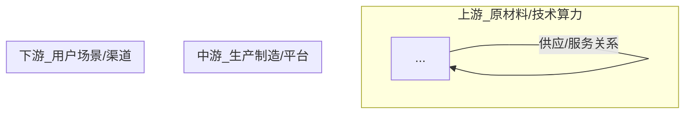

# quant-risk — 零成本 A股+港股 量化选股 Skill

## 项目定位

**零成本 · A股+港股 量化选股 AI Skill**（Claude Code · Codex · ZCode 通用）：给人方便使用，GitHub 下载即用——一行命令 `install_skill.sh` 装为 AI Skill，对话即可推荐标的/分析单股/每日信号/持仓诊断。数据全部来自**免费公开接口**（腾讯/东财/新浪/Yahoo，零注册、零 API Key、零订阅）。覆盖 **A 股 + 港股** 全生命周期风控：投前审查 → 持仓监控 → 预警触发 → 处置决策。脚本可直接 CLI 运行（`uv run scripts/...`），亦可 Docker。

**市场范围（2026-08-31 更新）**：美股已移出维护范围，**主看 A 股 + 港股**。`recommend_us.py`/`--market us` 属 legacy 兼容路径，不再维护、不纳入日常推荐流程。

**分发形态（2026-09-18 用户确认）**：以 Skill 分发为第一顺位（`scripts/install_skill.sh`/`install_skill.ps1`，装到 `~/.claude/skills/quant-risk` 或 `--dest` 指定 Codex/ZCode 目录，AI 首次执行时自动 `uv sync`）；Docker 镜像（GHCR，`--extra semantica` 全量）+ 本地 CLI（`install.sh`/`install.ps1`）为备选。仓库不携带用户本地数据（`data/` 记忆库、`report/` 生成物、`ve.pptx` 均已 gitignore/出库）。

## 核心约定（硬约束 + 指针）

- **🧠 变更即同步铁律**：用户每次对输出格式、模板、评分体系、分析流程提出的更改，**必须立即同步到 AGENTS.md 或对应 `docs/agents/` 主题文件**（swing-system / value-legacy / data-sources），不得延后。这是防止反复犯同样错误的根本措施。
- **Python 包管理**: 用 `uv add` 不用 pip
- **执行 Python**: 用 `uv run`
- **记忆系统**: AgentMemory（行为记忆） + OpenKnowledge（文档知识）双轨制
- **📄 主题文档索引（细节按需读取，不占常驻上下文）**：
  - `docs/agents/swing-system.md` — **波段系统全部决策细节**（四维评分/道氏/ATR/上车离场/候选池/回测闭环/MCP server/daily 工作流/舆情辅助/三tab简介）。任务涉及波段评分、候选池、回测、MCP、daily 时读取。
  - `docs/agents/value-legacy.md` — **legacy value 模式**（六维评分/四大师/缠论/投委会/镜像测试/行业漏斗/产业链Mermaid）。仅 `--mode value`、portfolio_report（六维/投委会部分；技术面已道氏化 2026-09-21）、tech_chan 时读取。
  - `docs/agents/data-sources.md` — **数据源优先级完整表**（行情/K线/基本面/资金面源链、限流排查、K线 fallback 链）。涉及数据获取与限流排查时读取。
  - `docs/agents/jev-advice.md` — **TypeSafe jev 外部 AI 裁决**（state/questions 写法、依赖 TYPESAFE_API_KEY、三类结构化问题、踩坑）。任务涉及 jev 模型、持仓买卖双引擎交叉验证、`scripts/jev_advice.py` 时读取。

- **数据分析方法（当前默认）**：A股与港股采用纯技术波段筛选，**持有周期不限定为 1-2 周——可以是几天、1 个月，若是真正的好标的持有 1 年也可**。总分 100 分：日线趋势 30 + 日线量价/资金 25 + 日线笔 20 + 30 分钟线段 25。基本面不参与评分、估值比较或一票否决；只使用行情、成交量、资金和道氏趋势（摆动点）数据。
- **波段方向判定（2026-09-08 起为道氏理论，替代缠论）**：日线方向用**道氏次级趋势**（摆动点序列判趋势）、30 分钟用**道氏小趋势**确认入场/离场。禁止把周线缠论、日线中枢、基本面评分或旧缠论笔/线段作为默认波段入场依据；30 分钟数据缺失或与日线方向冲突时只能观望。
- **滞后性纪律（必须时刻注意）**：道氏是「事后确认」理论，趋势反转天然滞后——要等价格跌破前低才确认转势。①动能走弱预警（价创新高但 MACD 柱收缩）的上升趋势必须降级处理——严格等回踩支撑介入、绝不追当日涨幅、仓位减半；②高位放量滞涨视为动能衰竭信号；③「回踩支撑企稳再介入」是默认操作而非可选项；④连续多日高位横盘警惕趋势末端。
- **记住：状态必须带触发价，禁止只输出"谨慎布局/观望"不给价格**（详见 swing-system.md 上车/离场条件条目）。

## 📋 输出格式铁律（已固化，直接执行，不必再查知识库）

以下规则经过反复踩坑后固化，是 quant-risk 项目的最高优先级行为规范，所有会话必须遵守。

### ⛔ 规则一：脚本输出原样展示，严禁追加手写内容

- 脚本输出的报告必须**原样展示**，严禁在末尾追加手写表格或自定义分析
- 所有格式统一由脚本的 formatter（`formatter.py` / `formatters/`）控制，改格式只改文件不改输出
- 需要补充分析时，放在脚本输出之后并用 `---` 分隔线隔开，且必须写明"以下为补充说明"

### 📌 规则二：脚本粘贴强制检查（反复踩坑）

执行脚本后，**第一步必须把 Bash/工具返回的脚本完整输出逐字复制到回复正文中**，不能只写"脚本输出完毕"就跳过。

反复出现的错误：模型拿到了工具结果但在 compose 回复时忘了粘贴，直接跳到补充说明。

**写回复前强制自问**：工具返回的每一行内容都贴到正文里了吗？确认后再发送。

### ⛔ 规则三：脚本输出绝不加 ``` 代码块（反复踩坑多次）

脚本输出本身是 markdown（含 `|` 表格），**直接粘贴到回复正文**，绝不能包在 ``` 代码块里——加了代码块表格就会变成纯文本，渲染不出来。

**写回复前强制自检**：
- 脚本输出有没有被包在 ``` 里？→ 如果有，去掉！
- 表格行有没有 `|` 分隔符？→ 应该有，在正文中直接渲染

### 🏷️ 规则四：LLM 补充分析必须标注数据来源

在 `---` 分隔线之后的"补充说明"中，**必须标明每条信息来源**。读者必须能区分哪些是原始数据、哪些是 LLM 的二次解读、哪些是外部检索补充的内容。

| 数据来源 | 标注格式 | 适用场景 |
|---------|---------|---------|
| 基于脚本输出的解读 | `> 📡 数据来源: 基于脚本输出解读` | 对四张表的数字做趋势判断、对比分析 |
| wigolo 联网检索（可溯源） | `> 📡 数据来源: wigolo [URL]` | 补充市占率、研报评级、行业景气度等脚本之外的数据 |
| 多源混合 | 每条内容单独标注 | 脚本输出 + wigolo 拼在一起写 |

**正确示例**：
```
---

## 以下为补充说明

> 📡 数据来源: 基于脚本输出解读

**技术面判断**：RSI14 仅 38.94，说明反弹动能不足；布林中轨 70.37 是短期压力位。

> 📡 数据来源: wigolo [https://www.xxx.com/report]

**行业背景**：MDI 价格处于近3年40%分位，行业景气度回暖。
```

### ✅ 规则五：脚本输出展示标准流程（反复踩坑后固化）

脚本输出必须通过 **文件落地 + Read 工具读取** 的方式展示，**禁止依赖 Bash 工具返回的 stdout 直接粘贴**（Bash 输出在某些视图下不可见）。

标准三步流程（**新会话也必须遵守，不可跳过**）：

1. **执行落地**：`uv run scripts/analyze.py <code> > /tmp/report.md 2>&1`
2. **Read 展示**：用 Read 工具读取 `/tmp/report.md` 显示完整内容
3. **补充说明**：在 `---` 分隔线后追加 LLM 补充说明

### 🔍 规则六：外部数据验证铁律（2026-07-17 新增）

**严禁用训练记忆数据充当事实输出。** 股票分析和推荐涉及外部事实性数据时，必须通过联网验证。

**适用范围**：
- 行业市占率、产能数据、全球排名
- 券商研报目标价、评级、盈利预测
- 财务指标的具体数值（季度营收/净利/ROE 等）
- 行业景气度、价格分位、供需平衡
- 公司战略、业务结构、技术壁垒等定性描述

**执行规则**：
1. **脚本输出**（analyze.py / recommend.py）→ 原样展示，不受影响
2. **补充说明中的事实性数据** → 必须用 wigolo 或 extract 验证后再写，且每条数据必须标注来源 URL
3. **某数据无法验证** → 明确标注"数据待验证，来源未确认"，严禁凭空填写
4. **仅凭逻辑推断的合理结论**（如"PE 偏低说明估值修复空间"）→ 可以写，因为这是分析方法不是事实数据

### ⚡ 规则七：输出风格偏好（2026-07-23 用户明确）

**这是硬性行为规范，每次输出必须遵守。**

| 偏好 | 说明 | 禁止的写法 | 正确的写法 |
|------|------|-----------|-----------|
| **强制给结论** | 每项分析必须给明确结论，不能含糊 | "可适当关注""值得关注" | 🔴止损 / 🟢买入 / 🟡持有 / 🟢加仓 |
| **不怕冲突** | 大师视角对抗要尖锐，质疑和答辩要直接冲突 | "各有道理""双方都有可取之处" | 一方明确驳斥另一方，给出明确胜负 |
| **数据诚实** | 缺失数据直接说"数据缺失"，不要胡编 | "无数据""暂无""—" | **数据缺失** |

**核心原则**：
- 不要怕和 LLM 吵架，用户就想看 LLM 吵架
- 如果缺失数据，就说"数据缺失"，不要编造"暂无"、"—"等模糊占位符
- 每项分析必须给可操作的结论（买/卖/持有/止损），不能只给"可关注"

**评分扣分可见（2026-07-23 新增）**：六维评分表中，若维度因大师质疑被扣分，评分列显示 `X.X/10 ↓-0.5`，扣分原因追加到大师视角列（`⚠️ 扣分原因：...`）。大师答疑列以 `✅质疑成立，评分已扣减` 或 `❌质疑不成立，评分不受影响` 开头，给出明确结论。

### 📐 规则八：结论先行、论据随后、数据溯源（2026-08-05 用户明确）

**这是硬性展示模板，每次输出分析必须遵守。**

展示结构（任何分析报告、个股点评、推荐回复统一采用）：

1. **结论先行**：第一屏先给操作结论（🟢买入 / 🟡持有 / 🔴止损 / 观望 + 仓位 + 一句话理由），禁止把结论埋在数据后面
2. **论据随后**：结论之后按「基本面 → 技术面 → 热点/情绪」顺序展开支撑论据，每个论据给明确方向（支持/反对当前结论）
3. **数据带溯源**：每个引用数据的论据行必须标注来源，格式 `> 📡 数据来源: ...`，脚本输出标注 `基于脚本输出解读`，外部检索标注 URL；禁止出现无来源的数字

**正确示例**：
```
**结论**：🟡 持有（10-20% 仓位）— 短期反弹到压力位，中线未反转，回踩企稳再补。

**论据一 · 基本面**（支撑持有）
- 营收 -11.8%、净利 +342.9%（主要靠投资收益）→ 主业弱，不构成买入理由
> 📡 数据来源: 东财 datacenter（脚本输出）

**论据二 · 技术面**（支撑持有/观望）
- 价格触及布林上轨 23.39，RSI 63，短线追高性价比低
> 📡 数据来源: 基于脚本输出解读
```

**禁止的写法**：先铺一大段表格/数据再给结论；引用数字但不标来源；结论含糊（"可适当关注"）。

**缠论必须给结论（2026-08-05 用户明确）**：缠论部分禁止只罗列「笔↓ / 中枢区间 / 价格位置」数据，必须输出一句话结论，包含三要素：
1. **方向**：🟢偏多 / 🟡中性 / 🔴偏空（含评分）
2. **买卖点**：当前有没有一/二/三类买卖点或背驰信号；无则明确写"当前无买卖点信号，等待背驰或突破确认"
3. **操作含义**：把缠论结论翻译成可操作语言（等回踩 / 等突破 / 观望 / 警惕三卖）

示例：`缠论结论：🟡 中性（评分 -2）| 单中枢盘整（偏空）| 当前无买卖点信号，等待背驰或突破确认 → 操作：观望，等回踩中枢下沿或放量突破再介入`

### 📊 规则九：表格报告必须含买卖价格与逻辑（2026-08-31 用户明确）

**这是硬性展示规范，每次出表格推荐报告必须遵守。**

凡输出标的表格（推荐清单、调仓路线图、执行计划等），每只标的**必须同时给出价格与逻辑两栏，缺一不可**：

| 必含字段 | 说明 | 禁止的写法 |
|---------|------|-----------|
| **买入价/区间** | 具体数字或区间，注明"现价追"/"回踩X企稳"/"突破X介入" | "逢低买入""择机介入" |
| **卖出价/目标** | 具体数字，附涨幅预期 | "看到上方""压力位附近" |
| **止损价** | 具体数字，附跌幅 | "设好止损" |
| **买入逻辑** | 一句话讲清为什么买（资金/量价/缠论/舆情/板块） | 只写评分不写理由 |
| **卖出逻辑** | 一句话讲清什么条件下离场（到价/破位/缩量滞涨/逻辑证伪） | "动态调整" |

**正确示例**：

| 标的 | 买入 | 止损 | 目标 | 买入逻辑 | 卖出逻辑 |
|:----|:----|:----|:----|:----|:----|
| 诺德股份 600110 | 回踩11.5企稳介入（勿追12.03） | 11.07(-8%) | 13.23(+10%) | 主力5日+6.88亿名单最大+量比1.20量价齐升+锂电铜箔/AI服务器HVLP题材 | 到13.23止盈或跌破11.07无条件离场；持仓3日缩量滞涨减仓 |

**禁止**：只给"🟢买入"结论却不给价格；只给价格却不给为什么买/为什么卖；用"逢低""择机""动态"等不含数字的模糊词。

## 用户持仓读取顺序

当需要获取用户持仓信息时，按以下优先级依次查找，找到即停：

1. **当前会话上下文** — 用户在本轮对话中已提及的持仓
2. **AgentMemory** — 通过 `memory_recall` 查询关键词 `portfolio` / `持仓` / `holding`，**查询方法详见知识库** `/Users/xiazhicheng/project/llm_wiki/articles/agentmemory-mcp-query-method.md`
3. **询问用户** — 以上均无数据时，要求用户自行提供持仓信息

> 🗂️ **持仓数据仅存储在 AgentMemory 中，不保存本地文件**，不再有 `portfolio.json`。
> `portfolio_report.py` 通过 `--stdin` 参数接收持仓 JSON，AI 从 AgentMemory 取出后通过管道传入。


## 用户持仓自动保存规则

**触发时机**（满足任一即执行保存）：

1. **用户主动提供或更新持仓信息时** — 用户明确说出"我的持仓是..."、"买入/卖出了XX"等
2. **持仓诊断/风控分析完成后** — 分析结果涉及持仓变动建议时
3. **会话结束时** — 本会话中持仓信息发生过变更

**保存操作（写入 AgentMemory）：**

通过 `memory_save`，参数：
   - `content`: 完整的持仓 JSON 内容（账户总览 + 各标的明细）
   - `type`: `"preference"`
   - `concepts`: `["portfolio", "持仓", user_name, ...]`

**注意：** 不要等待用户说"保存"才执行。上述触发时机到来时，自动执行保存。


## 🚀 一句话投资建议工作流（2026-07-24 更新）

用户只需说 **"给我投资建议"**（或类似的一句话），自动触发完整分析流程：

**步骤 1 — 获取持仓**
- 按「用户持仓读取顺序」查找持仓
- 有持仓 → 跳转步骤 2
- 无持仓 → 请用户手动输入或上传截图

**步骤 2 — 获取最新行情**
- 调用 `hk_stock_quote_tencent_async` 获取各标的最新价（无需更新本地文件）

**步骤 3 — 宏观环境联网检索（LLM 执行）**
- 使用 `wigolo` 查询当前宏观环境（每条数据必须标注来源 URL）：
  - 关键词示例：`"港股 2026年7月 市场走势"`、`"美联储 利率 最新"`、`"中东局势 原油"`、`"金十数据 宏观要闻"`
- 关注要点：美联储利率政策、地缘政治风险（中东/俄乌）、中国经济数据、港股资金流向、板块轮动
- 将宏观分析结论作为报告的**第一部分**，为后续组合诊断提供背景

**步骤 4 — 运行组合完整报告**
- 从 AgentMemory 取出持仓 JSON，通过 stdin 传入：
  `echo '{"holdings":[...]}' | uv run scripts/portfolio_report.py --stdin`
- 输出报告保存到 `report/` 目录

**步骤 5 — 运行新标的推荐**
- `uv run scripts/recommend.py`
- 输出 TOP10 推荐标的 + 投资委员会辩论 + 定价择时
- 输出报告保存到 `report/` 目录

**步骤 6 — LLM 综合分析（关键步骤）**
- **禁止直接粘贴脚本输出**——LLM 必须：
  1. 结合步骤 3 的宏观环境，解读每只持仓和推荐标的风险收益
  2. 对脚本生成的投资委员会辩论内容进行「委员会主席补充意见」：基于外部宏观环境判断是否需要调整仓位和方向
  3. 使用 wigolo 补充特定标的外部信息（如行业新闻、竞对动态、政策变化），每条数据必须标注来源 URL
- 输出格式：宏观环境 → 调仓路线图 → 组合总览 → 持仓诊断（含委员会主席宏观点评）→ 换仓建议（含委员会主席宏观点评）→ 执行计划

**输出格式铁律：**
- 脚本输出的报告**不直接粘贴**，而是由 LLM 解读后重新组织
- 所有宏观数据必须标注来源（`> 📡 来源: wigolo [URL]`）
- LLM 补充分析与脚本输出之间用 `---` 分隔

---

### 📋 投资建议报告（固定模板）

#### 第一部分：调仓路线图（结论先行）

**调仓路线图 Mermaid 图**（展示卖出标的→T+2到账→买入标的）

**组合总览**

| 指标 | 值 |
|:----|:---|
| 总投入 | XXXX HKD |
| 当前市值 | XXXX HKD |
| 总盈亏 | XX.XX%（XXXX HKD）|
| 持仓数 | X 只 |
| 集中度 TOP1 | 名称 XX.XX% ⚠️（超/未超50%红线）|
| 组合健康度 | ★★☆☆☆ X.X/5 |

**各股分析（逐只）**

按以下结构逐只输出，**不含六维评分表（已取消，改为投委会辩论）、不含行业漏斗（已取消）、不含镜子测试（已取消）**。

-----

**标的名称**（代码）— 成本 X.XX → 现价 X.XX | 盈亏 -X.XX%（-XXX HKD）| 仓位 XX.XX%

**公司概况**
- 🏢 **主营业务**: ...
- 👤 CEO: ... | 📍 ... | 👥 ...
- 📅 ...年成立 | 📊 ...年上市
- 📡 数据来源: ...

**🔧 产业链全景图**


```mermaid
graph TB
    subgraph 上游_原材料/技术算力
        ...
    end
    subgraph 中游_生产制造/平台
        ...
    end
    subgraph 下游_用户场景/渠道
        ...
    end
    ... -->|供应/服务关系| ...
```
> 卡脖子: 关键制约因素
> 竞品对标: 与行业龙头差距

**核心财务数据**（Mermaid 流程图展示营收增速/净利增速/ROE/毛利率/负债率/PE，🟢🔴🟡标记）

**🔧 技术面分析**

**① 周线大势**

| 指标 | 数据 |
|:----|:----|
| MA60 | XX.XX，偏离+X.XX% 🔴偏空/🟢偏多 |
| 道氏判定 | 上升/下降/震荡，摆动点N |

**② 日线走势**

| 指标 | 数据 |
|:----|:----|
| 走势类型 | 最近日线趋势 up/down/neutral（收盘价摆动点）|
| 道氏结论 | 🟢上升趋势/🟡震荡/🔴下降趋势，状态+边界（跌破前低X转空、突破前高Y延续），必须含操作含义 |
| 最近摆动点 | ↑/↓/➖ YYYY-MM-DD~YYYY-MM-DD [低X→高Y] |
| 趋势健康 | 上涨放量/缩量（量比X）|
| 三阶段 | 吸筹/公众参与/派发 |

**③ 关键信号**

| 维度 | 信号 | 数值 |
|:----|:----|:----:|
| MA排列 | 偏多/偏空/中性 | MA5=XX MA10=XX MA20=XX MA60=XX |
| MACD | 多头✅/空头❌ | DIF=XX DEA=XX 柱=XX |
| 动能预警 | ⚠️动能走弱/✅动能转强/无 | MACD 柱背离（价新高柱收缩）|
| 风控 | 止损-X.XX% | 止损 XX.XX / 卖出：移动止盈（跌破前低X或自高点回撤X%离场）|

**🔥 市场情绪**（Mermaid journey 图，10分制，价格40%+量能30%+趋势30%）

**🗳️ 投资委员会辩论**（Mermaid sequenceDiagram — 多方/空方/风控/委员会主席，4方角色）

**操作建议**: ✅持有 / 🔴止损 / 🟡减仓 / 🟢加仓

-----

（第二只标的重复相同结构）

---

#### 第二部分：关键提醒

- 各标的操作提醒（为什么这么操作）
- 🌍 宏观环境（委员会主席补充点评，基于 wigolo 联网检索，每条数据标注来源 URL）

---

> 📡 数据来源: scripts/portfolio_report.py + scripts/recommend.py 输出
> ⚠️ 声明：基于公开市场数据，不构成投资建议

---

**模板使用铁律**：
1. 每部分标题、表格列名、顺序**完全一致**，不能增删改列
2. 表格内容填脚本输出的实际值，没有值写"暂无"
3. 无持仓需要诊断时跳过第一部分，直接输出"当前无持仓"
4. 无可换仓资金时，推荐表格位置写"无可释放资金，当前无换仓需求"
5. 补充说明可以追加在 `---` 分隔线之后

- 保存本次持仓信息到 AgentMemory


## 架构速览 (V1.9.0)

所有代码统一在 `scripts/` 目录下，`quantrisk` 作为 `scripts/quantrisk/` 子包存在。

```
scripts/
├── analyze.py               统一多市场分析脚本
├── analyze_swing.py         单股波段分析（A股/港股，复用 swing 评分核心）🎯
├── daily_run.py             每日收盘工作流（Phase 1，无 LLM 依赖）🎯
├── recommend.py             统一推荐脚本入口
├── portfolio.py             持仓诊断工具
├── portfolio_report.py      持仓完整报告（产业链Mermaid+投委会辩论+道氏技术面+情绪面）🔥
├── jev_advice.py            TypeSafe jev 外部模型持仓买卖裁决（state/questions 见 docs/agents/jev-advice.md）🎯
├── tech_chan.py             缠论深度分析 + 产业链Mermaid输出 🔥
├── chan_mtf.py              缠论多周期联立分析
├── formatter.py             选股推荐格式化器 (Pydantic + 渲染)
├── formatters/              四阶段风控格式化器（_pretrade/_holding/_alert/_disposal）
├── mcp_server.py            MCP server（stdio + Streamable HTTP 双 transport，5 工具）
└── quantrisk/               Python 模块（scripts/quantrisk 子包）
    ├── data.py              数据层 — 行情/K线/基本面/资金面/信号/公告 + TickFlow
    ├── daily.py             每日编排：run_daily + render_daily_summary
    ├── chan.py              缠论 — 分型→笔→线段→中枢→背驰→买卖点
    ├── indicators.py        技术指标 — MA/MACD/RSI/KDJ/BOLL + 缠论 re-export
    ├── screener.py          标的池筛选 + 批量查询
    ├── report.py            StockAnalyzer 一键全量分析入口
    ├── recommender.py       共享过滤/评分引擎
    ├── recommend_cn.py      A股选股推荐适配器
    ├── recommend_hk.py      港股选股推荐适配器
    ├── recommend_us.py      美股选股推荐适配器（legacy）
    └── chain_renderer.py    产业链渲染器：Mermaid 图文本生成
```

## 数据源优先级（速览，完整表见 docs/agents/data-sources.md）

| 数据类型 | 主源 | 备选 | 备注 |
|---------|------|------|------|
| A股行情 | 腾讯(不封IP) | 东财 push2 | — |
| A股日K | 腾讯(前复权) | 新浪 / 百度(带MA) / TickFlow(兜底) | 2026-08-31 新浪日K上线 |
| 港股行情 | 腾讯(78字段) | 新浪(25字段) | — |
| 港股日K | 腾讯(ifzq.gtimg.cn) | Yahoo / TickFlow(兜底) | 统一入口 `hk_kline_async`（2026-09-18），新浪港股日K已失效 |
| 基本面(港股A股) | 东财 datacenter | Yahoo(key stats) | — |
| 缠论K线 | 腾讯 / Yahoo / 新浪 | TickFlow(兜底) | 支持前复权 |

**腾讯 K 线域名（2026-08-12 修复）**：`http://web.ifzq.gtimg.cn`（HTTP+web 前缀）已失效 501，修复为 `_tencent_kline_get()` 多域名降级：`https://ifzq.gtimg.cn` → `https://proxy.finance.qq.com/ifzqgtimg/`。**HTTPS + 非 web 前缀是硬要求**，改回 `web.ifzq.gtimg.cn` 会让缠论全挂（缠论评分 6/20 最低基准 = K 线源全挂的信号）。

## 文件清单（核心）

| 文件/目录 | 用途 |
|-----------|------|
| SKILL.md | Skill 主定义 (数据函数 + 风控模板) |
| README.md | 项目说明 |
| CHANGELOG.md | 版本记录 |
| AGENTS.md | 本文件（项目约定 + 行为铁律 + 文档索引）|
| docs/agents/ | 主题决策归档：swing-system / value-legacy / data-sources |
| scripts/daily_run.py | 🎯 每日收盘工作流 CLI 入口（A股+港股，无 LLM 依赖）|
| scripts/install_skill.sh / install_skill.ps1 | 🎯 Skill 一键安装（分发第一顺位）|
| Dockerfile | 🎯 镜像构建（python:3.12-slim + uv，`--extra semantica` 全量）|
| install.sh / install.ps1 | 🎯 本地一键安装（uv + Python 3.12 + 轻量依赖 + 冒烟自检）|
| .mcp.json / .zcode/config.json | MCP stdio 接入（Claude Code / ZCode）|
| .kimi-code/mcp.json | 🎯 Kimi Code MCP 接入（open-knowledge stdio server）|

## 分析框架（默认波段）

总分 100 分：**日线趋势 30 + 日线量价/资金 25 + 日线笔 20 + 30 分钟线段 25**。三档状态：当前可布局 / 谨慎布局 / 观望。详细评分维度、道氏三步、降级链、ATR 止损移动止盈、上车/离场条件见 `docs/agents/swing-system.md`。legacy 六维评分框架（`--mode value`）见 `docs/agents/value-legacy.md`。
