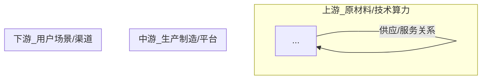

# quant-risk — 全生命周期风控 Skill

## 项目定位

Codex Skill，覆盖 **A 股 + 港股** 全生命周期风控：投前审查 → 持仓监控 → 预警触发 → 处置决策。

**市场范围（2026-08-31 更新）**：美股已移出维护范围，**主看 A 股 + 港股**。`recommend_us.py`/`--market us` 属 legacy 兼容路径，不再维护、不纳入日常推荐流程。

## 核心约定

- **🧠 变更即同步铁律**：用户每次对输出格式、模板、评分体系、分析流程提出的更改，**必须立即同步到 AGENTS.md 中对应的模板/规则部分**，不得延后。这是防止反复犯同样错误的根本措施。
- **Python 包管理**: 用 `uv add` 不用 pip
- **执行 Python**: 用 `uv run`
- **记忆系统**: AgentMemory（行为记忆） + OpenKnowledge（文档知识）双轨制
- **单股波段分析（2026-09-01 新增）**：`uv run scripts/analyze_swing.py 600388`（A股6位/港股5位，可批量）。与 `recommend.py --mode swing` 同源，复用 `swing.py` 评分核心 + `data.py` 数据层，仅把"全市场扫描"改为"指定个股"。输出：波段四维评分（日线趋势30+量价资金25+日线笔20+30分钟线段25）+ 日线/30m 缠论结论（规则八格式）+ 布局状态（可布局/谨慎/观望）+ 止损/目标 + 三刀筛辅助数据（量比/缠论双周期/板块）。数据获取：A股日K走腾讯→新浪→百度→TickFlow、30m 走 **Yahoo→东财→新浪→腾讯mkline→mootdx**（源链，2026-09-07 Yahoo/东财双限流后新增新浪/腾讯/mootdx 3 个 A股备用源）、资金流走东财分钟级；港股日K走腾讯→Yahoo、30m 走 **Yahoo→东财**（2026-09-07 排查确认腾讯无港股分钟接口、新浪港股K线接口已下线、Aastocks/同花顺/雪球均不可用——港股 30m 仅此两源，均为时间性限流，恢复后自动生效）、资金流走东财 secid_prefix=116。**美股不支持**（已移出维护）。
- **数据分析方法（当前默认）**：A股与港股采用纯技术波段筛选，**持有周期不限定为 1-2 周——可以是几天、1 个月，若是真正的好标的持有 1 年也可**。总分 100 分：日线趋势 30 + 日线量价/资金 25 + 日线笔 20 + 30 分钟线段 25。基本面不参与评分、估值比较或一票否决；只使用行情、成交量、资金和缠论数据。
- **波段缠论周期（当前默认）**：只使用**日线笔**判断波段方向、30 分钟**线段**确认入场/离场。禁止把周线缠论、日线中枢或基本面评分作为默认波段入场依据；30 分钟数据缺失或与日线笔方向冲突时只能观望。
- **ATR 动态止损/目标（2026-09-01 用户明确，替代固定 -8%/+10%）**：固定 -8% 止损/+10% 目标太机械（不同股票波动率差近8倍：上港 2ATR≈3.5%、工行≈4.0%、中国有色矿业≈11.2%、康希诺≈27%），已改为 `swing.py` 的 `swing_sl_tp()` ATR14 动态计算：止损 = max(现价−2×ATR, 日线笔低点×0.985)，百分比 clamp 到 [5%, 11%]；目标 = 现价+3×ATR，百分比 clamp 到 [8%, 25%] 且目标比例≥止损比例×1.5（RR≥1.5:1）；ATR 缺失（日K不足15根）时回退固定 -8%/+10%。渲染展示 `止损X.XX（-Y.Y%）| 目标Z.ZZ（+W.W%），ATR0.1`。改动点：`swing.py` 新增 `swing_sl_tp()` + `swing_score_one` 调用 + `__all__`、`render_swing_report`/`analyze_swing.py render_one` 渲染带 ATR 依据；测试 `test_swing_sl_tp_*` 4 个用例（低波动5%下限/高波动11%上限/无ATR兜底/笔低点兜底）。
- **波段缠论结论输出（2026-08-31 修复）**：`swing.py` 的 `daily_stroke_score`/`intraday_segment_score` 现在输出 `chan_conclusion` 缠论一句话结论（规则八格式），包含三要素：①方向（🟢偏多/🟡中性/🔴偏空，以 `chan.py` `classify_trend` 的**整体走势 direction** 为准，最近一笔/线段方向仅作参考）；②走势/中枢/买卖点/背驰（如"单中枢盘整（偏空）｜中枢[6.27~6.98]｜卖点：三卖"）；③操作含义（可布局/等回踩/观望警惕续跌）。**关键坑**：整体走势 direction 与最近笔方向冲突时（如"无中枢单边下跌"里出现 up 笔），必须在结论里标注"下跌趋势中的反弹笔"，不能只按最近笔判多。
- **波段布局状态三档（2026-08-31 新增）**：`swing_score_one` 的 status 判定加入缠论整体方向：短线日线笔+30分钟线段共振 up 但缠论整体走势 down 时，标 **🟡谨慎布局：短线共振但缠论整体偏空**（而非"当前可布局"），杜绝"报告说可布局、缠论说观望"的自相矛盾。`build_swing_report` 的 advice 映射同步：`谨慎布局`→🟡谨慎布局。
- **东财资金流限流坑（2026-08-31 修复）**：港股/A股波段推荐的"主力5日"显示 +0.00亿 **不一定是数据源失效**——东财 `fflow` 接口在高并发（如两个市场脚本并行执行，共 400+ 只同时拉取）时静默返回空数组，`fund_flow_daily_async` 返回 `[]` 后管线显示 +0.00亿。**已修复**：`data.py` 的 `fund_flow_daily_async` 加全局限流信号量（并发 5，`_fflow_sem`）+ 空返回指数退避重试（0.5s/1s/2s，4 轮），所有资金流调用方统一受控；两市场脚本并行执行实测主力资金全部恢复真实值（招行 +3.84亿、工行 +3.84亿）。注意区分：部分 A 股小盘（600241/600318/600348 等）东财 fflow 本身无覆盖，长期 +0.00亿属覆盖问题非限流。
- **舆情与资金热点辅助（2026-08-31 集成，08-31 升级为强制流程）**：集成外部技能 [last30days-skill](https://github.com/mvanhorn/last30days-skill)（v3.21.1）作为 ZCode 用户级技能（`~/.agents/skills/last30days/`），跨 Reddit/X/YouTube/StockTwits/Polymarket 等平台按真实参与度评分合成舆情简报。**每次找标的（`recommend.py` 输出 TOP10 后）必须用 `/last30days` 舆情辅助判断市场热点板块，并用资金进入情况（主力5日/量比）交叉验证——这是强制流程，不得跳过**。交叉验证逻辑：舆情确认板块是真共识还是游资讲故事（看 Reddit/社区讨论深度与参与度），资金面确认是否有真金白银跟进（主力5日净流入+量比>1 为量价齐升）。两者同向才可介入，背离则观望。技能源仓库缓存在 `~/.zcode/cli/skills-cache/last30days-skill/`，`git pull` 即可更新。免费源（Reddit/HN/Polymarket/GitHub/Web）零配置可用；yt-dlp（YouTube 字幕）可选；X/Twitter 需浏览器 cookie，TikTok/Instagram 需 ScrapeCreators。
- **价值评分链（legacy）**：六维基本面、5:3:2、基本面一票否决、周线定势/日线定点保留在 `--mode value` 兼容路径，不属于 A股/港股默认波段推荐逻辑。
- **📊 一图胜千言（2026-07-23 新增）**：所有分析报告优先使用 Mermaid 图而非纯表格。目前包含 4 种 Mermaid 图类型：
  - **产业链全景图（流程图+子图）**：上中下游子图+竞争格局+核心财务数据，边框颜色区分层级（蓝=上游、橙=中游、绿=下游、粉=竞争、紫=财务）
  - **大师辩论（时序图）**：5 参与者（段永平/巴菲特/芒格/李录/系统），每个维度 6 步骤 2 轮辩论，`Note over` 分隔维度，数据源标注在节点中
  - **一票否决（时序图）**：4 参与者（漏斗/逆向/镜子/结论），逐项检查后汇总结论
  - **技术面/情绪面（流程图）**：4 个子图展示趋势/缠论/量价/支撑或新闻/机构/资金/板块，每条数据标注数据源
  - 图的目的是减少文字阅读负担，表格只作为补充，Mermaid 图类型按数据特性选择（流程图展示结构、时序图展示流程、Journey 图展示评分）
- **金融数据精度工具 (`scripts/financial_rigor.py`)**：借鉴 ai-berkshire 的金融严谨性工具，提供市值验算（股价×总股本 vs 报告市值）、估值指标精确验算（PE/PB/ROE/FCF Yield）、多源交叉验证（N个来源自动比对，>1%标记）。所有计算使用 Python `decimal.Decimal`（精确十进制），非 `float`（浮点近似）。
- **芒格式逆向检验**：在 `_raw_score_one` 中生成"这家公司可能怎么死"的逆向风险分析，基于负债率/营收增速/净利/ROE/毛利率等指标列出失败路径，呈现在详情块的"芒格式逆向检验"段落。
- **镜子测试**：在详情块末尾自动生成"5句话说清楚为什么买"，基于 ROE/PE/负债率/止损等数据逐句构建。≥5句通过，3-4句边缘，<3句未通过。贯彻"说不清楚不买"原则。
- **留白原则**：C级信息丰富度的标的，评分建议降一档（强烈关注→可关注），且输出追加留白声明"数据严重不足，置信度较低"。
- **双重舍入链修复**：`percentile_score_all` 中评分计算改为先保留精确值再一次性舍入，消减约 0.2-0.3 分累积误差，消除 69.5→70.0 边界误判。
- **投委会裁决反哺铁律（2026-08-12 修复）**：定价建议表/详情块择时/择时判断段落**三处展示必须共用同一套投委会裁决来源**，禁止各自独立判定。裁决逻辑集中在 `formatter.py` 的 `_committee_counts()`（多方项/空方项/熔断标记计算）+ `_committee_verdict()`（方向+仓位），投委会Mermaid、定价表 advice、`_render_detail_block` 和 `_render_timing_block` 的 timing 全部调用这两个函数。委员会判"卖出/回避"（如 PE>80 触发熔断但技术面强势）时：定价表 advice 覆盖为"回避"，timing 覆盖为"暂不建议入场（委员会否决）"——**杜绝"定价说强烈关注、择时说可布局、委员会说卖出"的自相矛盾**。已知坑：summary code 是 `"600201 生物股份"`（含名称），detail code 是 `"600201"`（纯代码），匹配时需 `s.code.split()[0]` 提取纯代码。
- **ai-berkshire 项目引用**：本项目借鉴了 [ai-berkshire](https://github.com/xbtlin/ai-berkshire) 的以下 SOP：
  - **六维评分框架**：生意质量(段永平)、护城河(巴菲特)、管理层(段永平+巴菲特)、最大风险(芒格)、文明趋势(李录)、估值(巴菲特+段永平)
  - **行业研究 SOP** (`industry-research.md`)：产业链全景图、全球扫描、文明趋势判断
  - **行业漏斗筛选 SOP** (`industry-funnel.md`)：四层漏斗、5条硬指标、AI偏见自查
  - **芒格式逆向检验**：公司级+行业级风险分析
  - **镜子测试**：5句话说清楚为什么买
## 📋 输出格式铁律（已固化，直接执行，不必再查知识库）

以下规则经过反复踩坑后固化，是 quant-risk 项目的最高优先级行为规范，所有会话必须遵守。

### ⛔ 规则一：脚本输出原样展示，严禁追加手写内容

- 脚本输出的报告必须**原样展示**，严禁在末尾追加手写表格或自定义分析
- 所有格式统一由脚本的 formatter（`formatter.py` / `formatters/`）控制，改格式只改文件不改输出
- 需要补充分析时，放在脚本输出之后并用 `---` 分隔线隔开，且必须写明"以下为补充说明"

### 📌 规则二：脚本粘贴强制检查（反复踩坑）

执行脚本后，**第一步必须把 Bash/工具返回的脚本完整输出逐字复制到回复正文中**，不能只写"脚本输出完毕"就跳过。

反复出现的错误：模型拿到了工具结果但在 compose 回复时忘了粘贴，直接跳到补充说明。

**写回复前强制自问**：工具返回的每一行内容都贴到正文里了吗？确认后再发送。

### ⛔ 规则三：脚本输出绝不加 ``` 代码块（反复踩坑多次）

脚本输出本身是 markdown（含 `|` 表格），**直接粘贴到回复正文**，绝不能包在 ``` 代码块里——加了代码块表格就会变成纯文本，渲染不出来。

**写回复前强制自检**：
- 脚本输出有没有被包在 ``` 里？→ 如果有，去掉！
- 表格行有没有 `|` 分隔符？→ 应该有，在正文中直接渲染

### 🏷️ 规则四：LLM 补充分析必须标注数据来源

在 `---` 分隔线之后的"补充说明"中，**必须标明每条信息来源**。读者必须能区分哪些是原始数据、哪些是 LLM 的二次解读、哪些是外部检索补充的内容。

| 数据来源 | 标注格式 | 适用场景 |
|---------|---------|---------|
| 基于脚本输出的解读 | `> 📡 数据来源: 基于脚本输出解读` | 对四张表的数字做趋势判断、对比分析 |
| wigolo 联网检索（可溯源） | `> 📡 数据来源: wigolo [URL]` | 补充市占率、研报评级、行业景气度等脚本之外的数据 |
| 多源混合 | 每条内容单独标注 | 脚本输出 + wigolo 拼在一起写 |

**正确示例**：
```
---

## 以下为补充说明

> 📡 数据来源: 基于脚本输出解读

**技术面判断**：RSI14 仅 38.94，说明反弹动能不足；布林中轨 70.37 是短期压力位。

> 📡 数据来源: wigolo [https://www.xxx.com/report]

**行业背景**：MDI 价格处于近3年40%分位，行业景气度回暖。
```

### ✅ 规则五：脚本输出展示标准流程（反复踩坑后固化）

脚本输出必须通过 **文件落地 + Read 工具读取** 的方式展示，**禁止依赖 Bash 工具返回的 stdout 直接粘贴**（Bash 输出在某些视图下不可见）。

标准三步流程（**新会话也必须遵守，不可跳过**）：

1. **执行落地**：`uv run scripts/analyze.py <code> > /tmp/report.md 2>&1`
2. **Read 展示**：用 Read 工具读取 `/tmp/report.md` 显示完整内容
3. **补充说明**：在 `---` 分隔线后追加 LLM 补充说明

### 🔍 规则六：外部数据验证铁律（2026-07-17 新增）

**严禁用训练记忆数据充当事实输出。** 股票分析和推荐涉及外部事实性数据时，必须通过联网验证。

**适用范围**：
- 行业市占率、产能数据、全球排名
- 券商研报目标价、评级、盈利预测
- 财务指标的具体数值（季度营收/净利/ROE 等）
- 行业景气度、价格分位、供需平衡
- 公司战略、业务结构、技术壁垒等定性描述

**执行规则**：
1. **脚本输出**（analyze.py / recommend.py）→ 原样展示，不受影响
2. **补充说明中的事实性数据** → 必须用 wigolo 或 extract 验证后再写，且每条数据必须标注来源 URL
3. **某数据无法验证** → 明确标注"数据待验证，来源未确认"，严禁凭空填写
4. **仅凭逻辑推断的合理结论**（如"PE 偏低说明估值修复空间"）→ 可以写，因为这是分析方法不是事实数据

### ⚡ 规则七：输出风格偏好（2026-07-23 用户明确）

**这是硬性行为规范，每次输出必须遵守。**

| 偏好 | 说明 | 禁止的写法 | 正确的写法 |
|------|------|-----------|-----------|
| **强制给结论** | 每项分析必须给明确结论，不能含糊 | "可适当关注""值得关注" | 🔴止损 / 🟢买入 / 🟡持有 / 🟢加仓 |
| **不怕冲突** | 大师视角对抗要尖锐，质疑和答辩要直接冲突 | "各有道理""双方都有可取之处" | 一方明确驳斥另一方，给出明确胜负 |
| **数据诚实** | 缺失数据直接说"数据缺失"，不要胡编 | "无数据""暂无""—" | **数据缺失** |

**核心原则**：
- 不要怕和 LLM 吵架，用户就想看 LLM 吵架
- 如果缺失数据，就说"数据缺失"，不要编造"暂无"、"—"等模糊占位符
- 每项分析必须给可操作的结论（买/卖/持有/止损），不能只给"可关注"

**评分扣分可见（2026-07-23 新增）**：六维评分表中，若维度因大师质疑被扣分，评分列显示 `X.X/10 ↓-0.5`，扣分原因追加到大师视角列（`⚠️ 扣分原因：...`）。大师答疑列以 `✅质疑成立，评分已扣减` 或 `❌质疑不成立，评分不受影响` 开头，给出明确结论。

### 📐 规则八：结论先行、论据随后、数据溯源（2026-08-05 用户明确）

**这是硬性展示模板，每次输出分析必须遵守。**

展示结构（任何分析报告、个股点评、推荐回复统一采用）：

1. **结论先行**：第一屏先给操作结论（🟢买入 / 🟡持有 / 🔴止损 / 观望 + 仓位 + 一句话理由），禁止把结论埋在数据后面
2. **论据随后**：结论之后按「基本面 → 技术面 → 热点/情绪」顺序展开支撑论据，每个论据给明确方向（支持/反对当前结论）
3. **数据带溯源**：每个引用数据的论据行必须标注来源，格式 `> 📡 数据来源: ...`，脚本输出标注 `基于脚本输出解读`，外部检索标注 URL；禁止出现无来源的数字

**正确示例**：
```
**结论**：🟡 持有（10-20% 仓位）— 短期反弹到压力位，中线未反转，回踩企稳再补。

**论据一 · 基本面**（支撑持有）
- 营收 -11.8%、净利 +342.9%（主要靠投资收益）→ 主业弱，不构成买入理由
> 📡 数据来源: 东财 datacenter（脚本输出）

**论据二 · 技术面**（支撑持有/观望）
- 价格触及布林上轨 23.39，RSI 63，短线追高性价比低
> 📡 数据来源: 基于脚本输出解读
```

**禁止的写法**：先铺一大段表格/数据再给结论；引用数字但不标来源；结论含糊（"可适当关注"）。

**缠论必须给结论（2026-08-05 用户明确）**：缠论部分禁止只罗列「笔↓ / 中枢区间 / 价格位置」数据，必须输出一句话结论，包含三要素：
1. **方向**：🟢偏多 / 🟡中性 / 🔴偏空（含评分）
2. **买卖点**：当前有没有一/二/三类买卖点或背驰信号；无则明确写"当前无买卖点信号，等待背驰或突破确认"
3. **操作含义**：把缠论结论翻译成可操作语言（等回踩 / 等突破 / 观望 / 警惕三卖）

示例：`缠论结论：🟡 中性（评分 -2）| 单中枢盘整（偏空）| 当前无买卖点信号，等待背驰或突破确认 → 操作：观望，等回踩中枢下沿或放量突破再介入`

### 📊 规则九：表格报告必须含买卖价格与逻辑（2026-08-31 用户明确）

**这是硬性展示规范，每次出表格推荐报告必须遵守。**

凡输出标的表格（推荐清单、调仓路线图、执行计划等），每只标的**必须同时给出价格与逻辑两栏，缺一不可**：

| 必含字段 | 说明 | 禁止的写法 |
|---------|------|-----------|
| **买入价/区间** | 具体数字或区间，注明"现价追"/"回踩X企稳"/"突破X介入" | "逢低买入""择机介入" |
| **卖出价/目标** | 具体数字，附涨幅预期 | "看到上方""压力位附近" |
| **止损价** | 具体数字，附跌幅 | "设好止损" |
| **买入逻辑** | 一句话讲清为什么买（资金/量价/缠论/舆情/板块） | 只写评分不写理由 |
| **卖出逻辑** | 一句话讲清什么条件下离场（到价/破位/缩量滞涨/逻辑证伪） | "动态调整" |

**正确示例**：

| 标的 | 买入 | 止损 | 目标 | 买入逻辑 | 卖出逻辑 |
|:----|:----|:----|:----|:----|:----|
| 诺德股份 600110 | 回踩11.5企稳介入（勿追12.03） | 11.07(-8%) | 13.23(+10%) | 主力5日+6.88亿名单最大+量比1.20量价齐升+锂电铜箔/AI服务器HVLP题材 | 到13.23止盈或跌破11.07无条件离场；持仓3日缩量滞涨减仓 |

**禁止**：只给"🟢买入"结论却不给价格；只给价格却不给为什么买/为什么卖；用"逢低""择机""动态"等不含数字的模糊词。

## 用户持仓读取顺序

当需要获取用户持仓信息时，按以下优先级依次查找，找到即停：

1. **当前会话上下文** — 用户在本轮对话中已提及的持仓
2. **AgentMemory** — 通过 `memory_recall` 查询关键词 `portfolio` / `持仓` / `holding`，**查询方法详见知识库** `/Users/xiazhicheng/project/llm_wiki/articles/agentmemory-mcp-query-method.md`
3. **询问用户** — 以上均无数据时，要求用户自行提供持仓信息

> 🗂️ **持仓数据仅存储在 AgentMemory 中，不保存本地文件**，不再有 `portfolio.json`。
> `portfolio_report.py` 通过 `--stdin` 参数接收持仓 JSON，AI 从 AgentMemory 取出后通过管道传入。

## 用户持仓自动保存规则

**触发时机**（满足任一即执行保存）：

1. **用户主动提供或更新持仓信息时** — 用户明确说出"我的持仓是..."、"买入/卖出了XX"等
2. **持仓诊断/风控分析完成后** — 分析结果涉及持仓变动建议时
3. **会话结束时** — 本会话中持仓信息发生过变更

**保存操作（写入 AgentMemory）：**

通过 `memory_save`，参数：
   - `content`: 完整的持仓 JSON 内容（账户总览 + 各标的明细）
   - `type`: `"preference"`
   - `concepts`: `["portfolio", "持仓", user_name, ...]`

**注意：** 不要等待用户说"保存"才执行。上述触发时机到来时，自动执行保存。

## 🚀 一句话投资建议工作流（2026-07-24 更新）

用户只需说 **"给我投资建议"**（或类似的一句话），自动触发完整分析流程：

**步骤 1 — 获取持仓**
- 按「用户持仓读取顺序」查找持仓
- 有持仓 → 跳转步骤 2
- 无持仓 → 请用户手动输入或上传截图

**步骤 2 — 获取最新行情**
- 调用 `hk_stock_quote_tencent_async` 获取各标的最新价（无需更新本地文件）

**步骤 3 — 宏观环境联网检索（LLM 执行）**
- 使用 `wigolo` 查询当前宏观环境（每条数据必须标注来源 URL）：
  - 关键词示例：`"港股 2026年7月 市场走势"`、`"美联储 利率 最新"`、`"中东局势 原油"`、`"金十数据 宏观要闻"`
- 关注要点：美联储利率政策、地缘政治风险（中东/俄乌）、中国经济数据、港股资金流向、板块轮动
- 将宏观分析结论作为报告的**第一部分**，为后续组合诊断提供背景

**步骤 4 — 运行组合完整报告**
- 从 AgentMemory 取出持仓 JSON，通过 stdin 传入：
  `echo '{"holdings":[...]}' | uv run scripts/portfolio_report.py --stdin`
- 输出报告保存到 `report/` 目录

**步骤 5 — 运行新标的推荐**
- `uv run scripts/recommend.py`
- 输出 TOP10 推荐标的 + 投资委员会辩论 + 定价择时
- 输出报告保存到 `report/` 目录

**步骤 6 — LLM 综合分析（关键步骤）**
- **禁止直接粘贴脚本输出**——LLM 必须：
  1. 结合步骤 3 的宏观环境，解读每只持仓和推荐标的风险收益
  2. 对脚本生成的投资委员会辩论内容进行「委员会主席补充意见」：基于外部宏观环境判断是否需要调整仓位和方向
  3. 使用 wigolo 补充特定标的外部信息（如行业新闻、竞对动态、政策变化），每条数据必须标注来源 URL
- 输出格式：宏观环境 → 调仓路线图 → 组合总览 → 持仓诊断（含委员会主席宏观点评）→ 换仓建议（含委员会主席宏观点评）→ 执行计划

**输出格式铁律：**
- 脚本输出的报告**不直接粘贴**，而是由 LLM 解读后重新组织
- 所有宏观数据必须标注来源（`> 📡 来源: wigolo [URL]`）
- LLM 补充分析与脚本输出之间用 `---` 分隔

---

### 📋 投资建议报告（固定模板）

#### 第一部分：调仓路线图（结论先行）

**调仓路线图 Mermaid 图**（展示卖出标的→T+2到账→买入标的）

**组合总览**

| 指标 | 值 |
|:----|:---|
| 总投入 | XXXX HKD |
| 当前市值 | XXXX HKD |
| 总盈亏 | XX.XX%（XXXX HKD）|
| 持仓数 | X 只 |
| 集中度 TOP1 | 名称 XX.XX% ⚠️（超/未超50%红线）|
| 组合健康度 | ★★☆☆☆ X.X/5 |

**各股分析（逐只）**

按以下结构逐只输出，**不含六维评分表（已取消，改为投委会辩论）、不含行业漏斗（已取消）、不含镜子测试（已取消）**。

-----

**标的名称**（代码）— 成本 X.XX → 现价 X.XX | 盈亏 -X.XX%（-XXX HKD）| 仓位 XX.XX%

**公司概况**
- 🏢 **主营业务**: ...
- 👤 CEO: ... | 📍 ... | 👥 ...
- 📅 ...年成立 | 📊 ...年上市
- 📡 数据来源: ...

**🔧 产业链全景图**


```mermaid
graph TB
    subgraph 上游_原材料/技术算力
        ...
    end
    subgraph 中游_生产制造/平台
        ...
    end
    subgraph 下游_用户场景/渠道
        ...
    end
    ... -->|供应/服务关系| ...
```
> 卡脖子: 关键制约因素
> 竞品对标: 与行业龙头差距

**核心财务数据**（Mermaid 流程图展示营收增速/净利增速/ROE/毛利率/负债率/PE，🟢🔴🟡标记）

**🔧 技术面分析**

**① 周线大势**

| 指标 | 数据 |
|:----|:----|
| MA60 | XX.XX，偏离+X.XX% 🔴偏空/🟢偏多 |
| 缠论判定 | 有/无中枢，笔X，方向 ↑/↓ |

**② 日线走势**

| 指标 | 数据 |
|:----|:----|
| 走势类型 | 单中枢盘整/无中枢单边上涨/下跌 |
| 最近笔 | ↑/↓ YYYY-MM-DD~YYYY-MM-DD [XX.XX→XX.XX] |
| 中枢区间 | ZG=XX.XX ZD=XX.XX ZZ=XX.XX，价格在内部/上方/下方 |

**③ 关键信号**

| 维度 | 信号 | 数值 |
|:----|:----|:----:|
| MA排列 | 偏多/偏空/中性 | MA5=XX MA10=XX MA20=XX MA60=XX |
| MACD | 多头✅/空头❌ | DIF=XX DEA=XX 柱=XX |
| 缠论买卖点 | 一买/二买/三买/无 | 底分型=XX(日期) 顶分型=XX(日期) |
| 风控 | 止损-X.XX% | 止损 XX.XX / 止盈 XX.XX |

**🔥 市场情绪**（Mermaid journey 图，10分制，价格40%+量能30%+趋势30%）

**🗳️ 投资委员会辩论**（Mermaid sequenceDiagram — 多方/空方/风控/委员会主席，4方角色）

**操作建议**: ✅持有 / 🔴止损 / 🟡减仓 / 🟢加仓

-----

（第二只标的重复相同结构）

---

#### 第二部分：关键提醒

- 各标的操作提醒（为什么这么操作）
- 🌍 宏观环境（委员会主席补充点评，基于 wigolo 联网检索，每条数据标注来源 URL）

---

> 📡 数据来源: scripts/portfolio_report.py + scripts/recommend.py 输出
> ⚠️ 声明：基于公开市场数据，不构成投资建议

---

**模板使用铁律**：
1. 每部分标题、表格列名、顺序**完全一致**，不能增删改列
2. 表格内容填脚本输出的实际值，没有值写"暂无"
3. 无持仓需要诊断时跳过第一部分，直接输出"当前无持仓"
4. 无可换仓资金时，推荐表格位置写"无可释放资金，当前无换仓需求"
5. 补充说明可以追加在 `---` 分隔线之后

- 保存本次持仓信息到 AgentMemory

## 架构速览 (V1.8.0)

所有代码统一在 `scripts/` 目录下，`quantrisk` 作为 `scripts/quantrisk/` 子包存在。

```
scripts/
├── analyze.py               统一多市场分析脚本
├── analyze_swing.py         单股波段分析（A股/港股，复用 swing 评分核心）🎯
├── recommend.py             统一推荐脚本入口
├── portfolio.py             持仓诊断工具
├── portfolio_report.py      持仓完整报告（产业链Mermaid+投委会辩论+缠论+情绪面）🔥
├── tech_chan.py             缠论深度分析 + 产业链Mermaid输出 🔥
├── chan_mtf.py              缠论多周期联立分析
├── formatter.py             选股推荐格式化器 (Pydantic + 渲染)
├── formatters/              四阶段风控格式化器
│   ├── __init__.py
│   ├── _base.py             共享: FormatValidationError + 校验/渲染工具
│   ├── _pretrade.py         投前审查: format_pretrade()
│   ├── _holding.py          持仓监控: format_holding()
│   ├── _alert.py            预警触发: format_alert()
│   └── _disposal.py         处置决策: format_disposal()
└── quantrisk/               Python 模块（scripts/quantrisk 子包）
    ├── __init__.py          包入口
    ├── recommender.py       共享过滤/评分引擎
    ├── recommend_hk.py      港股选股推荐适配器
    ├── recommend_cn.py      A股选股推荐适配器
    ├── recommend_us.py      美股选股推荐适配器
    ├── data.py              数据层 — 行情/K线/基本面/资金面/信号/公告/期权/SEC/工具 + TickFlow
    ├── chan.py              缠论 — 分型→笔→线段→中枢→背驰→买卖点
    ├── indicators.py        技术指标 — MA/MACD/RSI/KDJ/BOLL + 缠论 re-export
	    ├── screener.py          标的池筛选 + 批量查询
	    └── report.py            StockAnalyzer 一键全量分析入口
```

## 数据源优先级

| 数据类型 | 主源 | 备选 | 备注 |
|---------|------|------|------|
| A股行情 | 腾讯(不封IP) | 东财 push2 | — |
| A股日K | 腾讯(前复权) | 新浪(免鉴权) / 百度(带MA) / TickFlow(兜底) | 2026-08-31 新浪日K上线，TickFlow 降级为最终兜底 |
| 港股行情 | 腾讯(78字段) | 新浪(25字段) | — |
| 港股日K | 腾讯(ifzq.gtimg.cn) | Yahoo / TickFlow(兜底) | 2026-08-12 修复：原 web.ifzq.gtimg.cn 已501，改用 ifzq.gtimg.cn；新浪港股日K接口已失效不可用 |
| 美股行情 | 腾讯(71字段) | 新浪(36字段) | — |
| 美股日K | 新浪 / Yahoo | TickFlow(兜底) | — |
| 基本面(港股A股) | 东财 datacenter | Yahoo(key stats) | — |
| 基本面(美股) | Yahoo | — | — |
| 缠论K线 | 腾讯(ifzq.gtimg.cn) / Yahoo / 新浪 | TickFlow(兜底) | TickFlow支持前复权 |

**腾讯 K 线域名（2026-08-12 修复）**：`http://web.ifzq.gtimg.cn`（HTTP+web 前缀）已失效返回 501，全部落到 TickFlow 导致缠论评分失真。修复为 `data.py` 的 `_tencent_kline_get()` 多域名降级：`https://ifzq.gtimg.cn` → `https://proxy.finance.qq.com/ifzqgtimg/`（均验证可用，0.1s，无 501）。**HTTPS + 非 web 前缀是硬要求**，改回 `web.ifzq.gtimg.cn` 会让缠论全挂（缠论评分 6/20 最低基准 = K 线源全挂的信号）。

**TickFlow** (免费免注册): 官方 SDK `pip install tickflow`，`TickFlow.free()` 模式
- 免费提供历史日K/周K/月K/季K/年K，无需 API Key
- 支持 A股(`.SH`/`.SZ`/`.BJ`) + 港股(`.HK`) + 美股(`.US`)
- 支持前复权 (`adjust=True`)
- 不支持实时行情和分钟级K线（free模式）
- 文档: https://docs.tickflow.org
- **2026-08-31 降级为最终兜底源**：`free-api.tickflow.org` 连接不稳定（频繁连接失败），所有 K 线 fallback 链中 TickFlow 移到最后，前端有腾讯/新浪/Yahoo 兜底，TickFlow 极少触发。`_get_tickflow()` 初始化加 8s 超时、`kline_tickflow_async` 数据请求加 10s 超时，失败快速返回不拖慢整体。

## 关键设计决策

- **代码从 SKILL.md 提取为 Python 模块**: V1.2.0 将之前散落在 SKILL.md 文本中的函数正式提取为可导入的 Python 包。V1.6.0 进一步重构评分系统为 100 分制、增加基本面 debug 明细、选股→定价→择时三段式输出、持仓择时判断。
- **所有代码统一在 scripts/ 目录**: 脚本入口 `scripts/*.py`，Python 模块 `scripts/quantrisk/*.py`，不再保留顶层 `quantrisk/` 目录
- **data.py 四合一**: HTTP 会话管理 + 行情层(8函数) + K线层(6函数) + 基本面/资金面/信号等(30函数)合并为一个文件，GitHub 浏览一目了然
- **scripts/ 入口**: 可直接 `uv run scripts/analyze.py 03690` 运行，无需 pip install
- **A股行情主力**: 腾讯 (不封IP) > 东财 push2
- **A股日K**: 腾讯 (前复权) > 新浪 (免鉴权) > 百度 (带MA) / mootdx (多周期) > TickFlow (最终兜底)
- **缠论背驰**: MACD面积对比, 阈值15%, 强背驰50%
- **缠论中枢**: 至少3段重叠 (min_overlap=3)
- **标准化笔**: 分型间距≥4根K线, 同向取极端值
- **数据获取**: 全部 aiohttp 异步, batch_*() 并行查询
- **标的池筛选**: 四层流程：①宏观扫描(板块排名→候选池) → ②中观过滤(市值/股价硬约束) → ③基本面一票否决(营收< -30%或净利< -30%或PE严重负值等8条直接淘汰，贯彻"六维评分为基础") → ④微观评分(六维评分×10+缠论×6+热点×4，满分100，5:3:2)
- **评分系统 V3（2026-07-22 重构，六维评分）**:
  - 借鉴 ai-berkshire 的"四大师视角对抗"框架，基本面评分拆分为 6 个独立维度
  - 📊 生意质量(段永平) → 毛利率/净利率/ROE，判断"这是对的生意吗？"
  - 🔒 护城河(巴菲特) → ROE/毛利率/股息率/负债率，判断"护城河深不深？"
  - 👔 管理层(段永平+巴菲特) → ROE/净利率/营收增速/负债率，判断"管理层值得信任吗？"
  - ⚠️ 最大风险(芒格) → 负债率/营收增速(负值重扣)/净利同比(负值重扣)，判断"怎么会死？"
  - 🌍 文明趋势(李录) → 营收增速/净利率/负债率/股息率/ROE，判断"10年后还在吗？"
  - 💰 估值(巴菲特+段永平) → PE相对估值/股息率，判断"够便宜吗？有安全边际吗？"
  - 每个维度独立评分（基础分 2.0，范围 1~10），各自在池内做百分位排名后等权平均
  - 合成公式：`fb_pct = (percentile(dim1) + ... + percentile(dim6)) / 6`
  - 映射公式：`fb = 1 + fb_pct×4`，`fb_w = round(fb×10, 1)`，满分 50
  - 百分位排名在未 clamp 的原始分上操作，扩大区分度
  - 独立裁决：基于百分位评分映射为 ✅ 通过(≥4.0) / ⚠️ 有条件通过(≥3.0) / ❓ 灰色地带(≥2.0) / ❌ 不通过(<2.0)
  - 投票制合成：6/6 通过→强烈推荐，5/6→推荐，3-4/6→灰色地带，1-2/6→不推荐，0/6→回避
  - 每个维度配有独立追问文本（基于原始指标生成定性分析），如"毛利率X%远超60%，有极强的定价权"
  - 信息丰富度评级：A级(7-9字段有值)/B级(4-6字段)/C级(<4字段)，标注在报告中
  - 三维评分合成（5:3:2）：`total = fb_w(六维基本面,50分) + ch_w(缠论技术面,30分) + hot_w(热点情绪面,20分) = 100分`
- **基本面一票否决（2026-07-20 新增，7-22 扩展为 8 条）**：
  - 在评分之前增加 `fundamental_veto()` 关卡，严重基本面恶化的标的不进评分池
  - 否决条件：营收同比<-30% 或 净利同比<-30% 或 PE<-10（严重亏损）或 负债率>90% 或 ROE<0 或 毛利率<10%且营收<0 或 PB<0 或 营收<净利
  - 否决记录在报告中独立展示
  - 贯彻"六维评分为基础"理念：技术面和热点再强，基本面崩塌的股票也不推荐
- **输出格式「四大师视角对抗 + 选股→定价→择时」三段式（2026-07-22 重构为四大师框架）**:
  - 第一步：选股（全市场扫描→中观过滤→TOP10 排名→各股四大师评分明细）
  - 第二步：定价（入场区间→止损→目标价→综合建议表）
  - 第三步：择时（四大师背景摘要 + 推荐标的买入时机 + **持仓卖出判断**）
  - 各股分析块以**四大师视角对抗**为中心：展示四大师评分表（含计算明细链如 `基础2.0+毛利率35.9%(>20%→0)+...`），并自动生成对抗分析文本（如"好生意≠好价格"、"长期vs短期的视角冲突"）
  - 满分 100 分，TOP10 表列名：`📊六维评分(50分) | 🔧缠论(30分) | 🔥热点(20分)`
- **TOP10 全量深度分析（2026-08-12 扩展）**：TOP10 推荐不再只深度分析 TOP5——Mermaid 排名图展示全部 10 只的三维评分，各股分析详情块覆盖全部 10 只，定价建议表增加评分列（`📊六维(50) | 🔧缠论(30) | 🔥热点(20) | 总分`）。改动点：`formatter.py` 的 `_render_top10_mermaid`（去掉 `[:5]`）、`recommender.py` 和 `recommend_hk.py` 的 `build_selection_data`（details 循环 `top10[:5]`→`top10`）、`SummaryItem` 模型加 `fb_w/ch_w/hot_w/total` 字段。**注意**：两个市场各有独立的 `build_selection_data`（`recommender.py` 给 A股/美股用、`recommend_hk.py` 给港股用），改详情层需同步改两处。
- **✨ 推荐理由速览表（2026-08-12 新增）**：在 Mermaid 排名图之后、各股分析之前，插入 `### ✨ 推荐理由速览` 表格，每只标的一行自动生成一句话理由。理由组成：基本面亮点（六维评分最高 1-2 个维度的结论文本）+ 技术面信号（缠论结论/MA排列）+ 情绪面（近5日涨幅/主力资金）+ 委员会方向（🟢买入/🟡持有/🔴回避）。**回避标的例外**：理由改为风险警示（指出 PE 畸高/ROE 低/负债率畸高等熔断原因），而非亮点。生成函数 `formatter.py` 的 `_gen_reason(d: DetailItem)` + `_render_reason_rows(details)`。
- **📊 得分构成可见（2026-08-14 新增）**：用户要求"看不到得分怎么算的"→ 两处展示评分过程：① 推荐理由速览表加「📊 得分构成」列（六维各维度 1-10 分 + 最高分维度完整计算明细链，`_score_breakdown()`）；② 详情块「二、财务数据与分析」插入六维评分明细表（得分/信心度/**得分逻辑**(dimN_debug 计算链)/大师视角/其他大师质疑/大师答疑）。**已知坑**：`_render_detail_block` 有两个 return，执行的是 855 行附近的 13 节模板，940-1067 行的 dim_table 构建是死代码——改评分展示必须插到 855 模板，不能改死代码区。
- **持仓卖出判断（2026-07-20 新增）**:
  - 当用户提供持仓信息后，择时步骤自动分析每只持仓的卖出时机
  - 输出格式：持有/减仓/卖出/加仓 + 具体理由（MA排列/MACD/资金流向）
  - 数据格式：`format_output(data, market)` 的 data 中传入 `portfolio_timing` 列表
  - 详见 `formatter.py` 的 `PortfolioTimingItem` 模型和 `_render_portfolio_timing()` 函数
- **缠论深度分析嵌入推荐模板（2026-07-21 新增）**:
  - 推荐报告的缠论部分从简略摘要升级为**周线大势 + 日K买卖点 + 笔结构**三层深度分析
  - **周线定大势**：从腾讯获取周K数据，计算周线MA60状态和缠论判定（偏多/中性/偏空）
  - **日K定买卖点**：从 `chan_risk_assessment` 提取最近底分型/顶分型价格与日期、是否站上MA5、最近笔方向
  - **买卖点 + 背驰**：展示一买/二买/三买/卖点详情，以及顶背驰/底背驰（强/弱）信号
  - 渲染位置：详情页"论据"段落后缩进展示，择时论据中追加"缠论"子段落
  - 核心数据流：`chan.py` → `chan_risk_assessment`（新增 fractals/strokes 字段）→ `recommender.py chan_score`（提取为 cd 字典）→ `recommend_hk.py build_selection_data`（填入 ch 字典）→ `formatter.py ChanDetail` 模型 → `_render_detail_block` / `_render_timing_block` 渲染
	  - **关键文件变更**：`chan.py`(fractals/strokes输出) + `recommender.py`(chan_score提取深度数据) + `recommend_hk.py`(周线获取+数据传递) + `formatter.py`(ChanDetail扩展+渲染)
	- **风控输出**: 每个阶段必须有明确结论 (买入/观望/拒绝 等)
- **港股行情财务字段扩展**: `hk_stock_quote_tencent_async()` 从腾讯78字段中提取10个财务字段(PE_TTM/ROE/毛利率/净利率/营收增长率/负债率/股息率)，无需额外API调用
- **推荐股票强制规则**: SKILL.md 中定义的3步强制流程(跨板块全市场扫描8板块→中观硬约束过滤→微观三维评分TOP10)，含固定输出模板，禁止跳过任何一步或单板块推荐
- **产业链分析 Mermaid 输出（2026-07-22 新增）**:
  - `portfolio_report.py` 和 `tech_chan.py` 支持输出 Mermaid 格式的产业链全景图
  - 饮料行业（02460）：上游 PET/水源/包材 → 中游 自有工厂/代工厂 → 下游 传统渠道/冷柜/电商
  - 软件行业（03888）：上游 AI大模型/云计算/硬件 → 中游 WPS/WPS365/WPS AI/游戏 → 下游 个人/政企/海外，含"飞钉微"竞争格局子图
  - 每个节点带 emoji 状态标记（🟢/🟡/🔴），卡脖子环节特殊标注
  - 标注与行业龙头的核心差距（毛利率/市占率/市值等）
- **行业漏斗5条硬指标（2026-07-22 新增）**:
  - 借鉴 ai-berkshire 漏斗 SOP：PE估值/ROE/营收增速/净利增速/负债率
  - 逐条检查并给出漏斗结果（通过/边缘/不通过）
  - 与基本面一票否决互补：否决是硬淘汰，漏斗是评分参考
- **芒格式行业级风险评估（2026-07-22 新增）**:
  - 在公司级风险（营收/净利/ROE/负债率）基础上，增加行业级风险
  - 含历史类比（如当前水战 vs 2010年代康师傅/统一收缩）
  - 行业特定风险如 PET 成本暴涨、冷柜战、"飞钉微"竞争格局
- **AI 偏见自查清单（2026-07-22 新增）**:
  - 报告末尾自动输出5种偏见自查：龙头偏好、成熟行业偏好、新业务偏好、英文偏好、故事偏好
  - 每条标注在报告中的对应处理方式
- **`portfolio_report.py` 一键报告（2026-07-22 新增）**:
  - 整合 8 大模块：组合总览 → 产业链Mermaid → 四大师 → 行业漏斗 → 芒格式风险 → 缠论 → 镜子测试 → AI偏见自查
  - 支持 `--stdin` 从 stdin 读取持仓 JSON（AI 从 AgentMemory 取出后传入）
  - 回退：本地 `portfolio.json`（虽已弃用但代码兼容）
  - 一行命令运行：`echo '{"holdings":[{"code":"02460","market":"hk","shares":4600,"avg_cost":10.334}]}' | uv run scripts/portfolio_report.py --stdin`
  - 镜子测试序号自动递增（①②③④⑤）

## 文件清单

| 文件/目录 | 用途 |
|-----------|------|
| SKILL.md | Skill 主定义 (数据函数 + 风控模板) |
| README.md | 项目说明 |
| CHANGELOG.md | 版本记录 |
| AGENTS.md | 本文件（项目约定和设计决策）|
| scripts/analyze.py | 统一多市场分析脚本（港股/A股/美股）|
| scripts/analyze_swing.py | 🎯 单股波段分析（A股/港股，复用 swing.py 评分核心 + data.py 数据层，输出四维评分+缠论结论+三刀筛辅助）|
| scripts/recommend.py | 统一推荐入口脚本 |
| scripts/portfolio.py | 持仓诊断工具 |
| scripts/portfolio_report.py | 🔥 持仓完整报告（产业链Mermaid+投委会辩论+缠论+情绪面）|
| scripts/tech_chan.py | 🔥 缠论深度分析 + 产业链Mermaid 输出 |
| scripts/chan_mtf.py | 缠论多周期联立分析 |
| scripts/formatter.py | 选股推荐格式化器 |
| scripts/formatters/ | 四阶段风控格式化器 |
| scripts/quantrisk/data.py | 数据层：行情/K线/基本面/资金面/信号/公告/期权/SEC/工具 + TickFlow |
| scripts/quantrisk/chan.py | 缠论：分型→笔→线段→中枢→背驰→买卖点 |
| scripts/quantrisk/indicators.py | 技术指标：MA/MACD/RSI/KDJ/BOLL/支撑压力/止损止盈 |
| scripts/quantrisk/chain_renderer.py | 产业链渲染器：Mermaid 图文本生成（纯渲染，无文件依赖） |
| scripts/quantrisk/screener.py | 标的池三层筛选 + 批量查询 |
| scripts/quantrisk/report.py | StockAnalyzer 一键全量分析入口 |
| scripts/quantrisk/recommender.py | 共享过滤/评分引擎 |
| scripts/quantrisk/recommend_hk.py | 港股选股推荐适配器 |
| scripts/quantrisk/recommend_cn.py | A股选股推荐适配器 |
| scripts/quantrisk/recommend_us.py | 美股选股推荐适配器 |

## 分析框架

三维评分体系（100 分制，2026-07-22 重构为六维评分；2026-08-05 权重改为 5:3:2）：

| 维度 | 满分 | 类型 | 子维度 | 核心问题 |
|------|:----:|:----:|--------|---------|
| 📊 六维评分 | 50 | 基本面 | 生意质量/护城河/管理层/最大风险/文明趋势/估值 | 估值合理吗？盈利质量如何？财务健康吗？ |
| 🔧 缠论 | 30 | 技术面 | 周线大势/MA排列/MACD/买卖点 | 结构位置在哪？有买卖点信号吗？（周线定势，日线定点）|
| 🔥 热点 | 20 | 情绪面 | 板块资金排名/个股资金流向/成交量/动量 | 是否在市场主线？ |

**满分**：六维评分 50 + 缠论 30 + 热点 20 = **100 分**（5:3:2）

**评分流程**：
1. 原始分计算 — 6 个维度各自独立评分（基础分 2.0，各维度加减分），hot_score 和 chan_score 同
2. 池内百分位排名（`percentile_score_all`）— 6 个维度百分位等权平均，hot/ch 各自映射到 1~5
3. 加权合成：`fb_pct = (percentile(dim1) + ... + percentile(dim6)) / 6`
4. 映射到 50 分：`fb_w = round((1 + fb_pct×4)×10, 1)`
5. 技术面：`ch_w = 百分位×6`（满分30），情绪面：`hot_w = 百分位×4`（满分20）
6. 总分：`total = fb_w + ch_w + hot_w`

**建议阈值**：≥70 强烈关注 | ≥56 可关注 | ≥44 观察 | <44 回避

**六维评分维度**（大师归属）：

| 维度 | 大师归属 | 核心指标 | 核心问题 |
|:----|:--------:|---------|---------|
| 📊 生意质量 | 段永平 | 毛利率/净利率/ROE | 这是对的生意吗？ |
| 🔒 护城河 | 巴菲特 | ROE/毛利率/股息率/负债率 | 护城河深不深？ |
| 👔 管理层 | 段永平+巴菲特 | ROE/净利率/营收增速/负债率 | 管理层值得信任吗？ |
| ⚠️ 最大风险 | 芒格 | 负债率/营收增速/净利同比 | 怎么会死？有什么风险？ |
| 🌍 文明趋势 | 李录 | 营收增速/净利率/负债率/ROE | 10年后还在吗？ |
| 💰 估值 | 巴菲特+段永平 | PE相对估值/股息率 | 够便宜吗？有安全边际吗？ |

**情绪面（热点）评分维度**（6 个）：
板块资金排名、个股资金流向、板块龙头、成交量、20 日动量、20 日累计资金流向

**技术面（缠论）评分维度**（5 个）：
**周线大势（偏多 +0.5 / 偏空 -0.5）**、MA 排列（7 档）、MACD 金叉/死叉、MA 交叉（MA5/MA20/MA60）、缠论买卖点信号

**输出格式**（2026-07-22 重构为四大师独立裁决+投票制框架，新增镜子测试+逆向检验+留白原则）：
- 第一步：**选股** — 全市场扫描 → 中观过滤 → TOP10 评分明细（含四大师独立裁决表 + 追问 + 投票制合成结论 + 芒格式逆向检验 + 留白声明）
- 第二步：**定价** — 入场区间 → 止损 → 目标价 → 综合建议表
- 第三步：**择时** — 四大师裁决摘要 → MA排列 → MACD → 资金流向 → 买卖时机建议
- 各股详情块末尾包含**镜子测试**：5句话说清楚为什么买，说不清楚不买

## OpenWiki

This repository has documentation located in the /openwiki directory.

Start here:
- [OpenWiki quickstart](openwiki/quickstart.md)

OpenWiki includes repository overview, architecture notes, workflows, domain concepts, operations, integrations, testing guidance, and source maps.

When working in this repository, read the OpenWiki quickstart first, then follow its links to the relevant architecture, workflow, domain, operation, and testing notes.
