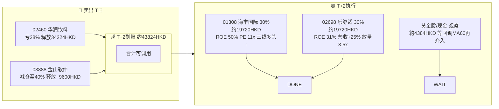
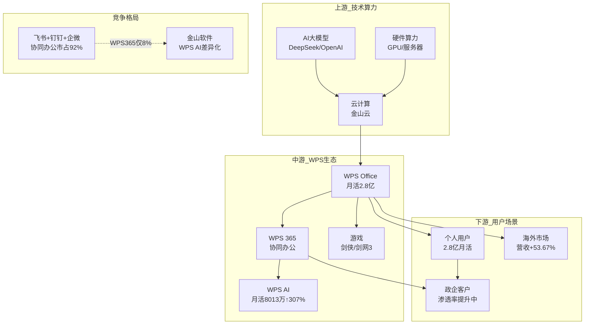
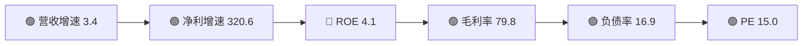
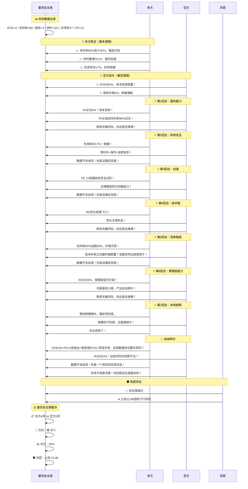
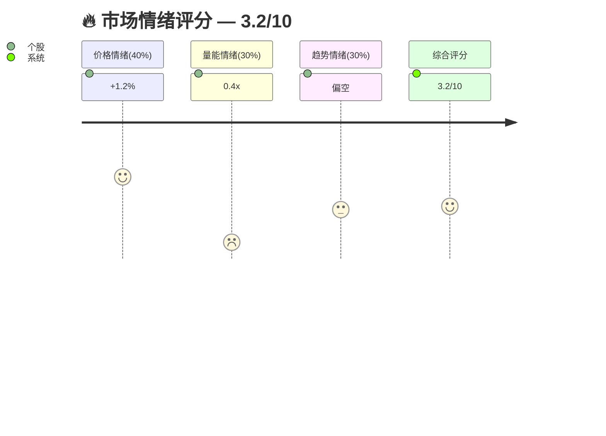
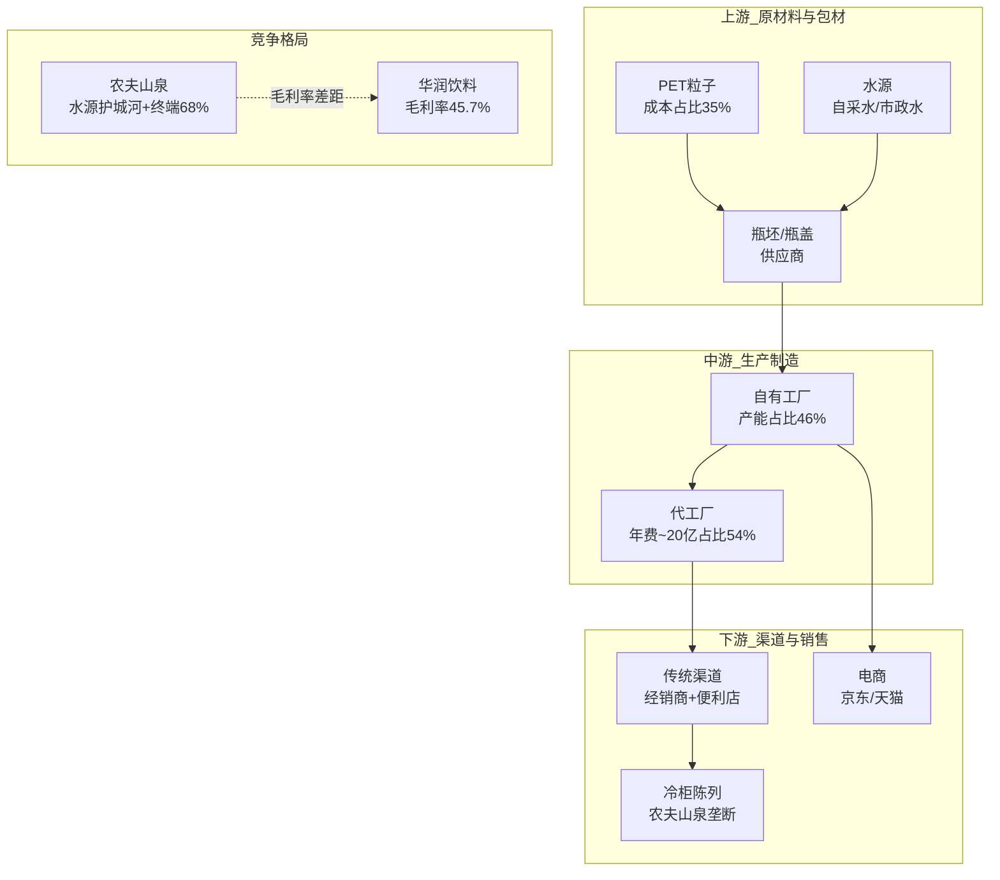
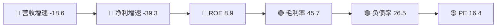
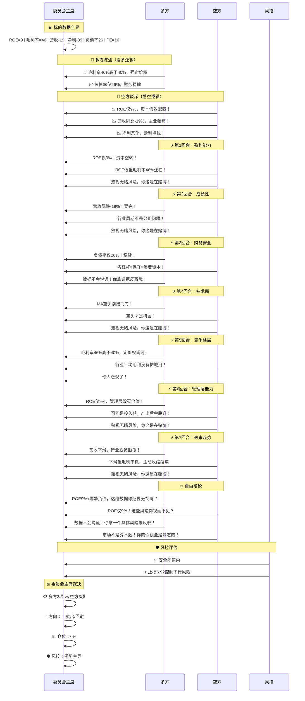
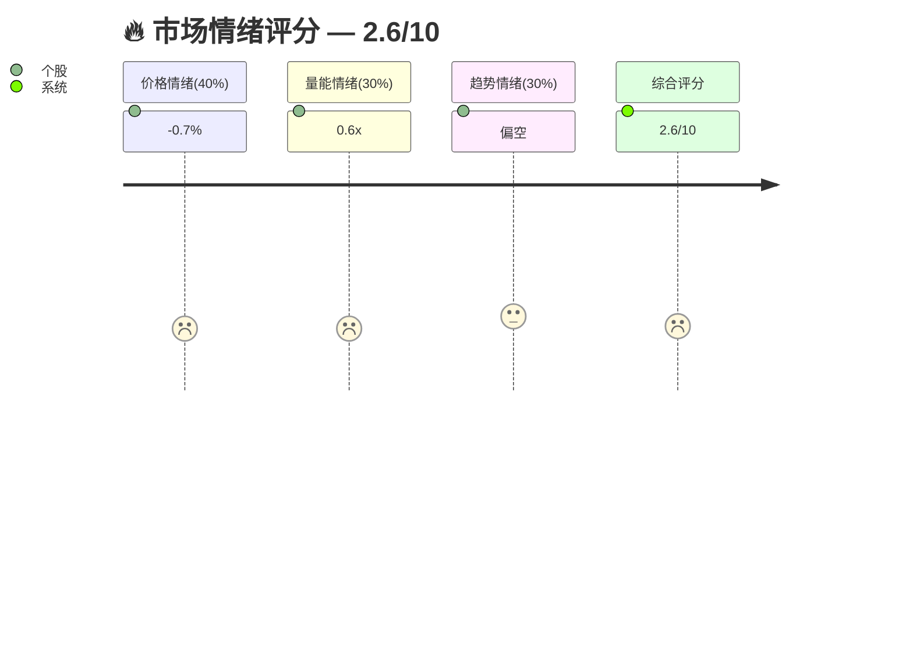

# 🏦 持仓组合完整报告 | 2026-07-24

## 📊 组合总览

| 指标 | 值 |
|:----|:---|
| 总投入 | 87557 HKD → 当前市值 72688 HKD |
| 总盈亏 | **-16.98%**（-14869 HKD）|
| 持仓数 | 2 只 |
| 集中度 TOP1 | 金山软件 52.92% ⚠️超50%红线|
| 组合健康度 | ★★★☆☆ 2.77/5 |

## 🎯 调仓路线图（结论先行）

---

## 🟡 金山软件（03888）— 1600 股

> 成本 25.01 → 现价 24.04 | 盈亏 **-3.89%**（-1557 HKD）| 仓位 52.92%

**基本信息**：金山软件（03888）| 现价：24.04 HKD
> 🏭 **主营业务**: 金山软件主营WPS Office办公软件及网络游戏业务，旗下拥有西山居等游戏工作室
CEO: 邹涛 | 📍 中国北京/珠海 | 👥 约15,000人 | 📅 1988年成立 | 📊 2007年上市
> 📡 数据来源: 公司公开信息（招股书/年报）| 腾讯行情

### 📊 基本面分析

**软件行业**

> **卡脖子**: 协同办公被'飞钉微'压制（92%市占率）| 游戏Q3同比-47%拖累利润
> **竞品对标**: 微软Office全球 vs WPS中国 | AI办公是弯道超车机会

### 📊 核心财务数据

> 📡 数据来源: 东财 datacenter（GMAININDICATOR）

### 🗳️ 投资委员会辩论

> 📡 数据来源: 东财 datacenter + 腾讯行情
### 🔥 市场情绪

> 📡 数据来源: 腾讯/新浪日K线 → 量价情绪评分

### 🔧 技术面分析

| 维度 | 指标 | 数据 |
|:----|:----|:----:|
| 周线大势 | MA60 | MA60=28.71 🔴偏空(-16.40%) |
| 周线大势 | 缠论判定 | 缠论:无中枢单边下跌 |
| 周线大势 | 缠论笔 | 笔2 |
| 日线走势 | 走势类型 | 单中枢盘整（偏空） |
| 日线走势 | 最近笔 | 最近笔: ↓ 2026-06-10~2026-07-14 [22.84→25.56] |
| 日线走势 | 中枢区间 | 中枢: ZG=25.56 ZD=20.50 ZZ=23.03 |
| 日线走势 | 价格位置 | 价格在中枢内部 ➖ |
| MA排列 | 偏多 | MA5=24.48(🔻-1.80%) | MA10=24.24(🔻-0.83%) | MA20=23.46(🔺2.45%) | MA60=23.11(🔺4.04%) |
| MACD | 多头✅ | DIF=0.48 DEA=0.36 柱=0.24 多头✅ |
| 布林带 | 价格在布林带中 | 上轨25.59 中轨23.46 下轨21.34 | 位置64% 中轨附近➖ |
| 缠论笔 | ↓ | 最近笔: ↓ 2026-06-10~2026-07-14 [22.84→25.56] |
| 风控 | 止损-5.16% | 止损 22.86 / 止盈 27.25 |

---

## 🔴 华润饮料（02460）— 4600 股

> 成本 10.33 → 现价 7.44 | 盈亏 **-28.00%**（-13312 HKD）| 仓位 47.08%

**基本信息**：华润饮料（02460）| 现价：7.44 HKD
> 🏭 **主营业务**: 华润饮料是华润集团旗下饮品平台，主营「怡宝」品牌纯净水及系列饮料
CEO: 张伟通 | 📍 中国深圳 | 👥 约12,000人 | 📅 1990年成立 | 📊 2025年上市
> 📡 数据来源: 公司公开信息（招股书/年报）| 腾讯行情

### 📊 基本面分析

**饮料行业**

> **卡脖子**: PET成本2026年+40% | 水源无独家壁垒 | 冷柜陈列被农夫山泉垄断
> **竞品对标**: 农夫山泉(ROE 30%+) vs 华润(ROE 8.9%) | 水源壁垒决定长期竞争力

### 📊 核心财务数据

> 📡 数据来源: 东财 datacenter（GMAININDICATOR）

### 🗳️ 投资委员会辩论

> 📡 数据来源: 东财 datacenter + 腾讯行情
### 🔥 市场情绪

> 📡 数据来源: 腾讯/新浪日K线 → 量价情绪评分

### 🔧 技术面分析

| 维度 | 指标 | 数据 |
|:----|:----|:----:|
| 周线大势 | MA60 | MA60=9.66 🔴偏空(-22.98%) |
| 周线大势 | 缠论判定 | 缠论:无中枢单边下跌 |
| 周线大势 | 缠论笔 | 笔2 |
| 日线走势 | 走势类型 | 无中枢单边上涨 |
| 日线走势 | 最近笔 | 最近笔: ↑ 2026-06-23~2026-07-21 [7.18→7.73] |
| MA排列 | 偏多 | MA5=7.51(🔻-0.93%) | MA10=7.49(🔻-0.71%) | MA20=7.37(🔺1.00%) | MA60=7.69(🔻-3.19%) |
| MACD | 多头✅ | DIF=-0.00 DEA=-0.04 柱=0.07 多头✅ |
| 布林带 | 价格在布林带中 | 上轨7.72 中轨7.37 下轨7.01 | 位置60% 中轨附近➖ |
| 缠论笔 | ↑ | 最近笔: ↑ 2026-06-23~2026-07-21 [7.18→7.73] |
| 风控 | 止损-7.51% | 止损 6.92 / 止盈 8.21 |

---

## 🎯 组合优化建议

| **02460 华润饮料** | 🔴 止损 | 释放~34224 HKD | 亏损-28.00%+六维评分低 |

> 合计可释放 **~34224 HKD** 用于重新配置

### 🧠 AI偏见自查清单

| 偏见 | 自查 |
|:----|:------|
| 🏢 龙头偏好 | 02460标注了与农夫山泉差距; 03888标注了'飞钉微'92%市占率 |
| 📝 成熟行业偏好 | 饮料行业补充了PET涨价+价格战数据 |
| 🎮 新业务偏好 | 03888标注游戏Q3-47%拖累 |
| 🌐 英文偏好 | 03888单独列出海外+53.67%增长 |
| 📊 故事偏好 | AI概念以WPS AI月活8013万(+307%)验证 |
| 🔍 数据复核校验 | ROE → 东财 datacenter（单一数据源📊，无备份，未交叉验证）⚠️ |
| 🔍 数据复核校验 | 毛利率 → 东财 datacenter（单一数据源📊，无备份，未交叉验证）⚠️ |
| 🔍 数据复核校验 | 营收增速 → 东财 datacenter（单一数据源📊，无备份，未交叉验证）⚠️ |
| 🔍 数据复核校验 | 净利增速 → 东财 datacenter（单一数据源📊，无备份，未交叉验证）⚠️ |
| 🔍 数据复核校验 | 负债率 → 东财 datacenter（单一数据源📊，无备份，未交叉验证）⚠️ |
| 🔍 数据复核校验 | PE → 腾讯行情（单一数据源📊，无备份，未交叉验证）⚠️ |
| 🔍 数据复核校验 | 日K线 → 腾讯（主）✅ + 新浪（备）✅ → 多源可用，可交叉验证 |
| 🔍 数据复核校验 | ⚠️ 以上标注「无备份」的字段，当前仅依赖单一数据源，无法做偏差≤1%校验 |

---
> 📡 数据来源: 基本面→东财datacenter（单一源⚠️）；行情→腾讯78字段（单一源⚠️）；日K线→腾讯主✅+新浪备✅。标注⚠️的字段仅依赖单一数据源，未做偏差≤1%交叉验证。
> ⚠️ 声明: 基于公开市场数据，不构成投资建议
> 脚本: scripts/portfolio_report.py | 2026-07-24 11:54
