🔍 港股推荐（候选池 200+ 只）...
## 港股选股推荐 | 2026-07-24

---

## 推荐结论

### TOP10 推荐标的（基本面分析）

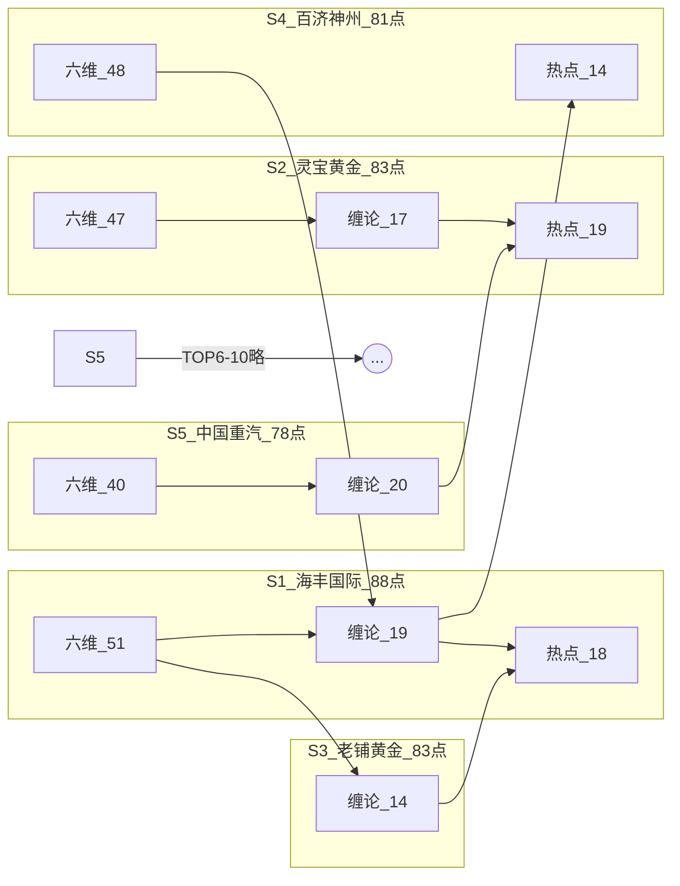

### 各股分析（基本面分析）

#### 1. 海丰国际（01308）— 强烈关注，适合布局 ✅ | 总分 88.1/100
📡 A级（数据充足） 关键指标：营收11.56%，净利18.96%，ROE50.09%，毛利率38.41%，负债率28.08%，PE11.11%

---
### 一、公司概况

**基本信息**：海丰国际（01308）| 现价：38.98 港元
> 📡 数据来源: 腾讯行情

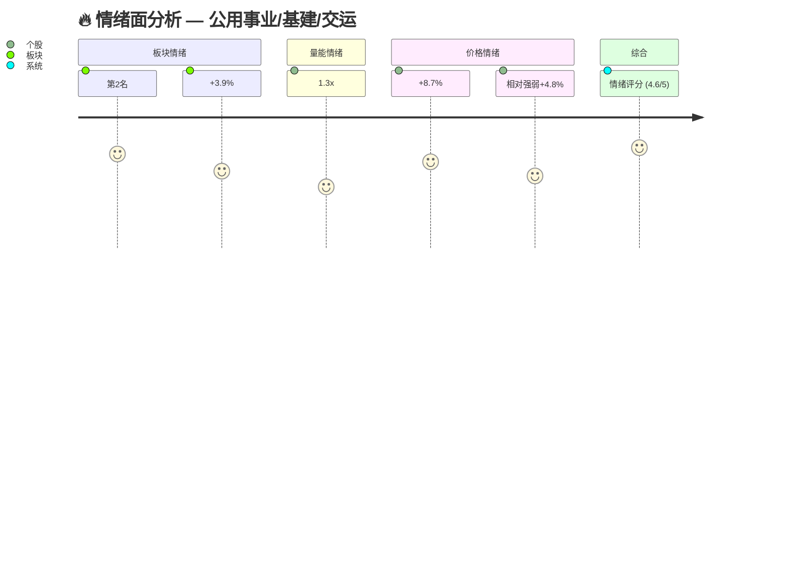
> 📡 数据来源: 腾讯/新浪日K线数据

---
### 二、财务数据与分析


> 📡 数据来源: 东财 datacenter（GMAININDICATOR）

---
### 三、技术分析

**🔧 18.8/20** | 当前可布局

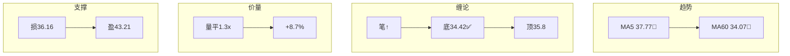
> 📡 数据来源: 腾讯/新浪日K线 → MA/MACD/缠论计算

---
### 四、市场情绪


> 📡 数据来源: 腾讯/新浪日K线 → 量价情绪评分

---
### 五、挑刺分析

**☠️ 致命风险路径**
- ☠ ✅ 财务结构健康，暂时无明显死亡路径。芒格会问：如果行业周期向下，这家公司能撑住吗？——从现有数据看，可以。

> 📡 数据来源: 东财基本面数据 + 芒格式逆向分析

---
### 六、投资哲学对照

**📋 核心检查清单**

| 检查项 | 结果 |
|:------|:----:|
| 好生意（ROE>15% or 毛利率>40%） | ✅ |
| 护城河（ROE持续>15%） | ✅ |
| 价格合理（PE<25） | ✅ |
| 财务安全（负债率<60%） | ✅ |
| 增长确定（营收+净利正增长） | ✅ |
> 📡 数据来源: 东财 datacenter

**🧭 四象限定位**

> **四象限定位**: 🟢 **明星** — 高ROE+正增长，巴菲特+李录都会喜欢
> **估值判断**: PE 11.1，偏低有安全边际（巴菲特：好价格）
> 📡 数据来源: 东财基本面数据

---
### 七、投资委员会辩论

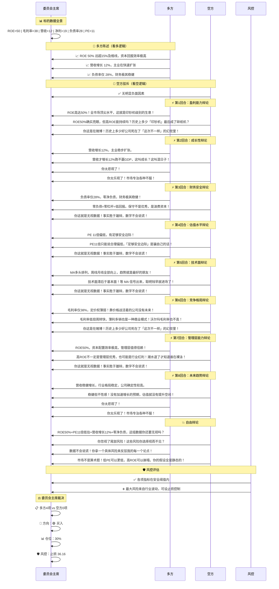

> 📡 数据来源: 东财 datacenter（六维评分模型）+ 腾讯行情（PE/市值）

---
### 八、图表参考

| # | 图表 | 说明 | 数据源 |
|:-:|:----|:----|:------|
| ① | 情绪面用户旅程图 | 板块/量能/价格/综合情绪评分 | 腾讯/新浪K线 |
| ② | 财务数据时间线 | 营收/净利/ROE/毛利率/负债率 | 东财 datacenter |
| ③ | 技术面流程图 | 趋势/缠论/价量/支撑 | 腾讯/新浪K线 |
| ④ | 一票否决时序图 | 逆向检验→镜子测试→操作建议 | 东财+腾讯 |
| ⑤ | 投资委员会辩论 | 多方/空方/风控/委员会主席三角色 | 东财+腾讯 |
				
#### 2. 灵宝黄金（03330）— 强烈关注，适合布局 ✅ | 总分 83.2/100
📡 A级（数据充足） 关键指标：营收10.76%，净利122.43%，ROE37.34%，毛利率21.46%，负债率56.92%，PE15.04%

---
### 一、公司概况

**基本信息**：灵宝黄金（03330）| 现价：18.65 港元
> 📡 数据来源: 腾讯行情

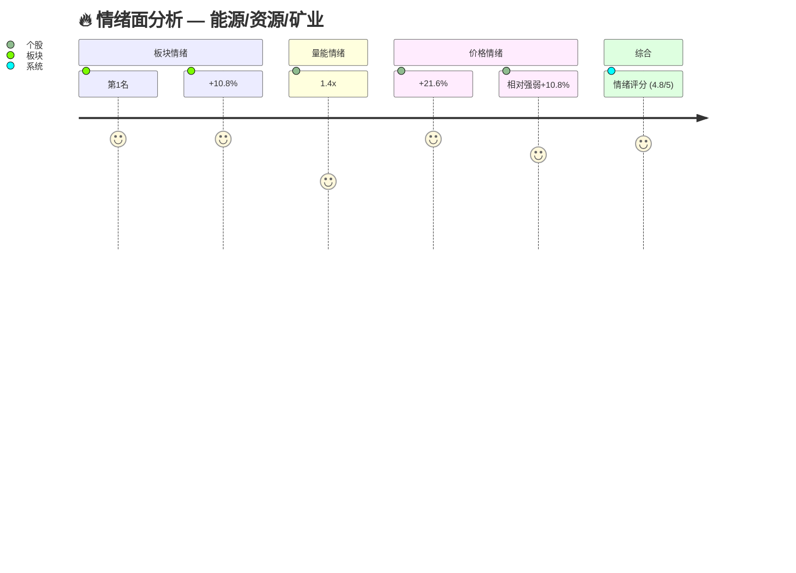
> 📡 数据来源: 腾讯/新浪日K线数据

---
### 二、财务数据与分析


> 📡 数据来源: 东财 datacenter（GMAININDICATOR）

---
### 三、技术分析

**🔧 16.9/20** | 等待回调介入

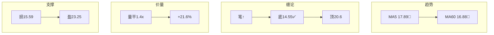
> 📡 数据来源: 腾讯/新浪日K线 → MA/MACD/缠论计算

---
### 四、市场情绪


> 📡 数据来源: 腾讯/新浪日K线 → 量价情绪评分

---
### 五、挑刺分析

**☠️ 致命风险路径**
- ☠ 负债率56.9%偏高，杠杆成本上升时会侵蚀利润
- ☠ 芒格会问：以上风险中，哪个最可能成真？如果成真，损失有多大？

**❓ 反共识压力测试**
- 🤔 负债率56.9%偏高——如果利率上升或盈利下滑，偿债压力会多大？极端情况下能否撑过2年不盈利？

> 📡 数据来源: 东财基本面数据 + 芒格式逆向分析

---
### 六、投资哲学对照

**📋 核心检查清单**

| 检查项 | 结果 |
|:------|:----:|
| 好生意（ROE>15% or 毛利率>40%） | ✅ |
| 护城河（ROE持续>15%） | ✅ |
| 价格合理（PE<25） | ✅ |
| 财务安全（负债率<60%） | ✅ |
| 增长确定（营收+净利正增长） | ✅ |
> 📡 数据来源: 东财 datacenter

**🧭 四象限定位**

> **四象限定位**: 🟢 **明星** — 高ROE+正增长，巴菲特+李录都会喜欢
> **估值判断**: PE 15.0，合理（巴菲特：价格一般）
> 📡 数据来源: 东财基本面数据

---
### 七、投资委员会辩论

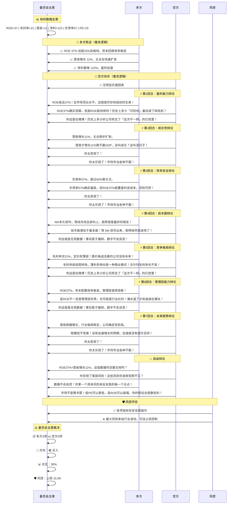

> 📡 数据来源: 东财 datacenter（六维评分模型）+ 腾讯行情（PE/市值）

---
### 八、图表参考

| # | 图表 | 说明 | 数据源 |
|:-:|:----|:----|:------|
| ① | 情绪面用户旅程图 | 板块/量能/价格/综合情绪评分 | 腾讯/新浪K线 |
| ② | 财务数据时间线 | 营收/净利/ROE/毛利率/负债率 | 东财 datacenter |
| ③ | 技术面流程图 | 趋势/缠论/价量/支撑 | 腾讯/新浪K线 |
| ④ | 一票否决时序图 | 逆向检验→镜子测试→操作建议 | 东财+腾讯 |
| ⑤ | 投资委员会辩论 | 多方/空方/风控/委员会主席三角色 | 东财+腾讯 |
				
#### 3. 老铺黄金（06181）— 强烈关注，适合布局 ✅ | 总分 82.6/100
📡 A级（数据充足） 关键指标：营收221.0%，净利230.45%，ROE64.84%，毛利率37.63%，负债率47.79%，PE11.95%

---
### 一、公司概况

**基本信息**：老铺黄金（06181）| 现价：364.4 港元
> 📡 数据来源: 腾讯行情

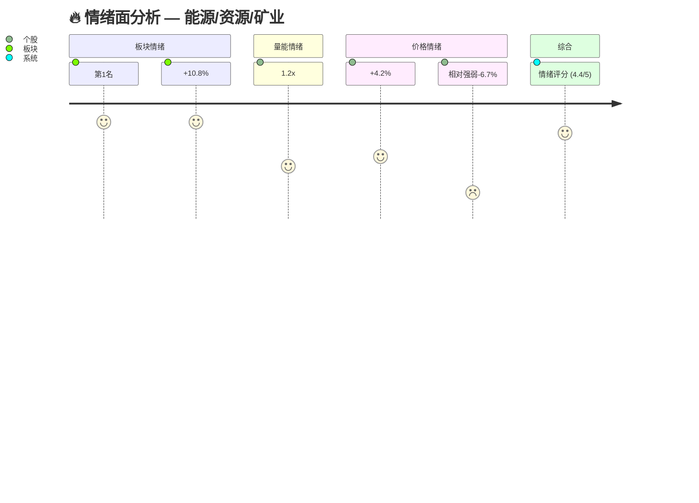
> 📡 数据来源: 腾讯/新浪日K线数据

---
### 二、财务数据与分析


> 📡 数据来源: 东财 datacenter（GMAININDICATOR）

---
### 三、技术分析

**🔧 13.8/20** | 观望，等待企稳

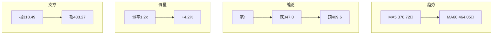
> 📡 数据来源: 腾讯/新浪日K线 → MA/MACD/缠论计算

---
### 四、市场情绪


> 📡 数据来源: 腾讯/新浪日K线 → 量价情绪评分

---
### 五、挑刺分析

**☠️ 致命风险路径**
- ☠ ✅ 财务结构健康，暂时无明显死亡路径。芒格会问：如果行业周期向下，这家公司能撑住吗？——从现有数据看，可以。

**❓ 反共识压力测试**
- 🤔 净利暴增230%，是否来自一次性收益或会计调整？扣非后的真实盈利能力是多少？

> 📡 数据来源: 东财基本面数据 + 芒格式逆向分析

---
### 六、投资哲学对照

**📋 核心检查清单**

| 检查项 | 结果 |
|:------|:----:|
| 好生意（ROE>15% or 毛利率>40%） | ✅ |
| 护城河（ROE持续>15%） | ✅ |
| 价格合理（PE<25） | ✅ |
| 财务安全（负债率<60%） | ✅ |
| 增长确定（营收+净利正增长） | ✅ |
> 📡 数据来源: 东财 datacenter

**🧭 四象限定位**

> **四象限定位**: 🟢 **明星** — 高ROE+正增长，巴菲特+李录都会喜欢
> **估值判断**: PE 11.9，偏低有安全边际（巴菲特：好价格）
> 📡 数据来源: 东财基本面数据

---
### 七、投资委员会辩论

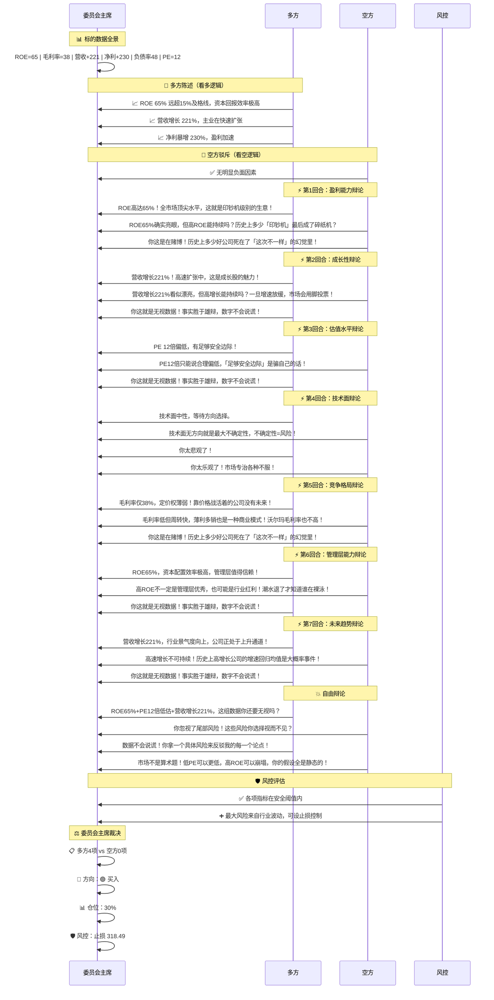

> 📡 数据来源: 东财 datacenter（六维评分模型）+ 腾讯行情（PE/市值）

---
### 八、图表参考

| # | 图表 | 说明 | 数据源 |
|:-:|:----|:----|:------|
| ① | 情绪面用户旅程图 | 板块/量能/价格/综合情绪评分 | 腾讯/新浪K线 |
| ② | 财务数据时间线 | 营收/净利/ROE/毛利率/负债率 | 东财 datacenter |
| ③ | 技术面流程图 | 趋势/缠论/价量/支撑 | 腾讯/新浪K线 |
| ④ | 一票否决时序图 | 逆向检验→镜子测试→操作建议 | 东财+腾讯 |
| ⑤ | 投资委员会辩论 | 多方/空方/风控/委员会主席三角色 | 东财+腾讯 |
				
#### 4. 百济神州（06160）— 强烈关注，适合布局 ✅ | 总分 81.2/100
📡 B级（部分数据缺失（缺失4个字段：ROE/负债率/PB）） 关键指标：营收35.46%，净利17802.13%，毛利率88.95%，PE137.65%

---
### 一、公司概况

**基本信息**：百济神州（06160）| 现价：199.4 港元
> 📡 数据来源: 腾讯行情

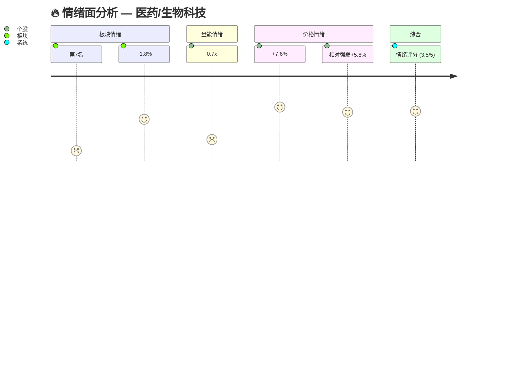
> 📡 数据来源: 腾讯/新浪日K线数据

---
### 二、财务数据与分析


> 📡 数据来源: 东财 datacenter（GMAININDICATOR）

---
### 三、技术分析

**🔧 18.8/20** | 当前可布局

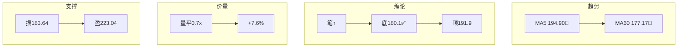
> 📡 数据来源: 腾讯/新浪日K线 → MA/MACD/缠论计算

---
### 四、市场情绪


> 📡 数据来源: 腾讯/新浪日K线 → 量价情绪评分

---
### 五、挑刺分析

**☠️ 致命风险路径**
- ☠ ROE仅0.0%，资本回报率低，竞争优势存疑
- ☠ 芒格会问：以上风险中，哪个最可能成真？如果成真，损失有多大？

**❓ 反共识压力测试**
- 🤔 净利暴增17802%，是否来自一次性收益或会计调整？扣非后的真实盈利能力是多少？
- 🤔 PE高达137.7——高估值是否已透支未来3-5年的增长？如果增速不及预期，股价可能面临戴维斯双杀

> 📡 数据来源: 东财基本面数据 + 芒格式逆向分析

---
### 六、投资哲学对照

**📋 核心检查清单**

| 检查项 | 结果 |
|:------|:----:|
| 好生意（ROE>15% or 毛利率>40%） | ✅ |
| 护城河（ROE持续>15%） | ❌ |
| 价格合理（PE<25） | ❌ |
| 财务安全（负债率<60%） | ❌ |
| 增长确定（营收+净利正增长） | ✅ |
> 📡 数据来源: 东财 datacenter

**🧭 四象限定位**

> **四象限定位**: 数据不足
> **估值判断**: PE 137.7，偏高（段永平：好生意也要好价格）
> 📡 数据来源: 东财基本面数据

---
### 七、投资委员会辩论

```mermaid
sequenceDiagram
    participant 委员会主席
    participant 多方
    participant 空方
    participant 风控
    

    Note over 委员会主席: 📊 标的数据全景
    委员会主席->>委员会主席: 毛利率=89 | 营收+35 | 净利+17802 | PE=138

    Note over 多方,委员会主席: 🔵 多方陈述（看多逻辑）
    多方->>委员会主席: 📈 毛利率 89% 高于40%，有强定价权
    多方->>委员会主席: 📈 营收增长 35%，主业在快速扩张
    多方->>委员会主席: 📈 净利暴增 17802%，盈利加速

    Note over 空方,委员会主席: 🔴 空方驳斥（看空逻辑）
    空方->>委员会主席: 📉 PE高达138，严重高估！

    Note over 多方,空方: ⚡ 第1回合：成长性辩论
    多方->>委员会主席: 营收增长35%！高速扩张中，这是成长股的魅力！
    空方->>委员会主席: 营收增长35%看似漂亮，但高增长能持续吗？一旦增速放缓，市场会用脚投票！
    多方->>委员会主席: 你这就是无视数据！事实胜于雄辩，数字不会说谎！

    Note over 多方,空方: ⚡ 第2回合：估值水平辩论
    多方->>委员会主席: PE高达138倍！严重高估，任何利空都会引发暴跌！
    空方->>委员会主席: PE高是因为市场看到了你看不到的增长潜力！嫌贵的人永远买不到好公司！
    空方->>委员会主席: 你这是在赌博！历史上多少好公司死在了「这次不一样」的幻觉里！

    Note over 多方,空方: ⚡ 第3回合：技术面辩论
    多方->>委员会主席: MA多头排列，周线月线全部向上，趋势就是最好的朋友！
    空方->>委员会主席: 技术面滞后于基本面！等 MA 信号出来，聪明钱早就进场了！
    多方->>委员会主席: 你这就是无视数据！事实胜于雄辩，数字不会说谎！

    Note over 多方,空方: ⚡ 第4回合：竞争格局辩论
    多方->>委员会主席: 毛利率89%远超60%，有极强的定价权！这就是护城河！
    空方->>委员会主席: 历史上有多少高毛利率的公司最后被颠覆了？诺基亚、柯达都曾是暴利！
    多方->>委员会主席: 你这就是无视数据！事实胜于雄辩，数字不会说谎！

    Note over 多方,空方: ⚡ 第5回合：未来趋势辩论
    多方->>委员会主席: 营收增长35%，行业景气度向上，公司正处于上升通道！
    空方->>委员会主席: 高速增长不可持续！历史上高增长公司的增速回归均值是大概率事件！
    多方->>委员会主席: 你这就是无视数据！事实胜于雄辩，数字不会说谎！

    Note over 多方,空方: 💥 自由辩论
    多方->>委员会主席: 营收增长35%，这组数据你还要无视吗？
    空方->>委员会主席: PE138倍透支未来！这些风险你选择视而不见？
    多方->>委员会主席: 数据不会说谎！你拿一个具体风险来反驳我的每一个论点！
    空方->>委员会主席: 市场不是算术题！低PE可以更低，高ROE可以崩塌，你的假设全是静态的！

    Note over 风控,委员会主席: 🛡️ 风控评估
    风控->>委员会主席: 🔴 PE138超高估！

    Note over 委员会主席: ⚖️ 委员会主席裁决
    委员会主席->>委员会主席: 📋 多方3项 vs 空方1项
    委员会主席->>委员会主席: 🎯 方向：🔴 卖出/回避
    委员会主席->>委员会主席: 📊 仓位：0%（清仓）
    委员会主席->>委员会主席: 🛡 风控：止损 183.64
```

> 📡 数据来源: 东财 datacenter（六维评分模型）+ 腾讯行情（PE/市值）

---
### 八、图表参考

| # | 图表 | 说明 | 数据源 |
|:-:|:----|:----|:------|
| ① | 情绪面用户旅程图 | 板块/量能/价格/综合情绪评分 | 腾讯/新浪K线 |
| ② | 财务数据时间线 | 营收/净利/ROE/毛利率/负债率 | 东财 datacenter |
| ③ | 技术面流程图 | 趋势/缠论/价量/支撑 | 腾讯/新浪K线 |
| ④ | 一票否决时序图 | 逆向检验→镜子测试→操作建议 | 东财+腾讯 |
| ⑤ | 投资委员会辩论 | 多方/空方/风控/委员会主席三角色 | 东财+腾讯 |
				
#### 5. 中国重汽（03808）— 强烈关注，适合布局 ✅ | 总分 78.3/100
📡 A级（数据充足） 关键指标：营收15.23%，净利14.6%，ROE16.3%，毛利率15.08%，负债率65.25%，PE14.74%

---
### 一、公司概况

**基本信息**：中国重汽（03808）| 现价：41.5 港元
> 📡 数据来源: 腾讯行情

```mermaid
journey
    title 🔥 情绪面分析 — 制造/工业/半导体
    section 板块情绪
      第8名: 0.5: 板块
      +0.7%: 3.8: 板块
    section 量能情绪
      3.9x: 7.0: 个股
    section 价格情绪
      +11.5%: 6.2: 个股
      相对强弱+10.8%: 6.0: 个股
    section 综合
      情绪评分 (4.7/5): 6.6: 系统
```
> 📡 数据来源: 腾讯/新浪日K线数据

---
### 二、财务数据与分析

```mermaid
flowchart LR
    m0["🟢 营收增速 15.2"] --> m1["🟢 净利增速 14.6"] --> m2["🟢 ROE 16.3"] --> m3["🟢 毛利率 15.1"] --> m4["🟡 负债率 65.2"] --> m5["🟢 PE 14.7"]
```
> 📡 数据来源: 东财 datacenter（GMAININDICATOR）

---
### 三、技术分析

**🔧 19.8/20** | 当前可布局

```mermaid
flowchart TB
    subgraph 趋势
        direction LR
        n0["MA5 39.49🔺"] --> n1["MA60 39.42🔺"]
    end
    subgraph 缠论
        direction LR
        n2["笔↑"] --> n3["底34.88✅"] --> n4["顶40.12"]
    end
    subgraph 价量
        direction LR
        n5["放巨量3.9x"] --> n6["+11.5%"]
    end
    subgraph 支撑
        direction LR
        n7["损36.87"]
        n8["盈48.45"]
        n7 --> n8
    end
```
> 📡 数据来源: 腾讯/新浪日K线 → MA/MACD/缠论计算

---
### 四、市场情绪

```mermaid
journey
    title 🔥 情绪面分析 — 制造/工业/半导体
    section 板块情绪
      第8名: 0.5: 板块
      +0.7%: 3.8: 板块
    section 量能情绪
      3.9x: 7.0: 个股
    section 价格情绪
      +11.5%: 6.2: 个股
      相对强弱+10.8%: 6.0: 个股
    section 综合
      情绪评分 (4.7/5): 6.6: 系统
```
> 📡 数据来源: 腾讯/新浪日K线 → 量价情绪评分

---
### 五、挑刺分析

**☠️ 致命风险路径**
- ☠ 负债率65.2%偏高，杠杆成本上升时会侵蚀利润
- ☠ 芒格会问：以上风险中，哪个最可能成真？如果成真，损失有多大？

**❓ 反共识压力测试**
- 🤔 负债率65.2%偏高——如果利率上升或盈利下滑，偿债压力会多大？极端情况下能否撑过2年不盈利？
- 🤔 毛利率仅15.1%，定价权薄弱——如果原材料成本再上涨10%，是否会侵蚀全部利润？

> 📡 数据来源: 东财基本面数据 + 芒格式逆向分析

---
### 六、投资哲学对照

**📋 核心检查清单**

| 检查项 | 结果 |
|:------|:----:|
| 好生意（ROE>15% or 毛利率>40%） | ✅ |
| 护城河（ROE持续>15%） | ✅ |
| 价格合理（PE<25） | ✅ |
| 财务安全（负债率<60%） | ❌ |
| 增长确定（营收+净利正增长） | ✅ |
> 📡 数据来源: 东财 datacenter

**🧭 四象限定位**

> **四象限定位**: 🟢 **明星** — 高ROE+正增长，巴菲特+李录都会喜欢
> **估值判断**: PE 14.7，偏低有安全边际（巴菲特：好价格）
> 📡 数据来源: 东财基本面数据

---
### 七、投资委员会辩论

```mermaid
sequenceDiagram
    participant 委员会主席
    participant 多方
    participant 空方
    participant 风控
    

    Note over 委员会主席: 📊 标的数据全景
    委员会主席->>委员会主席: ROE=16 | 毛利率=15 | 营收+15 | 净利+15 | 负债率65 | PE=15

    Note over 多方,委员会主席: 🔵 多方陈述（看多逻辑）
    多方->>委员会主席: 📈 ROE 16% 远超15%及格线，资本回报效率极高
    多方->>委员会主席: 📈 营收增长 15%，主业在快速扩张
    多方->>委员会主席: 📈 PE 15 处于低估区间，有安全边际

    Note over 空方,委员会主席: 🔴 空方驳斥（看空逻辑）
    空方->>委员会主席: 📉 毛利率仅15%，定价权薄弱！
    空方->>委员会主席: 📉 负债率65%，杠杆过高！

    Note over 多方,空方: ⚡ 第1回合：盈利能力辩论
    多方->>委员会主席: ROE 16%超过15%及格线，资本回报效率优秀。
    空方->>委员会主席: ROE才16%刚过及格线就吹？优秀企业ROE应该25%起步！
    多方->>委员会主席: 你太悲观了！
    空方->>委员会主席: 你太乐观了！市场专治各种不服！

    Note over 多方,空方: ⚡ 第2回合：成长性辩论
    多方->>委员会主席: 营收增长15%，主业稳步扩张。
    空方->>委员会主席: 营收才增长15%跑不赢GDP，这叫成长？这叫混日子！
    多方->>委员会主席: 你太悲观了！
    空方->>委员会主席: 你太乐观了！市场专治各种不服！

    Note over 多方,空方: ⚡ 第3回合：财务安全辩论
    多方->>委员会主席: 负债率65%，超过50%需关注。
    空方->>委员会主席: 负债率65%确实偏高，但ROE16%能覆盖利息成本，风险可控！
    多方->>委员会主席: 你太悲观了！
    空方->>委员会主席: 你太乐观了！市场专治各种不服！

    Note over 多方,空方: ⚡ 第4回合：估值水平辩论
    多方->>委员会主席: PE 15倍偏低，有足够安全边际！
    空方->>委员会主席: PE15倍只能说合理偏低，「足够安全边际」是骗自己的话！
    多方->>委员会主席: 你这就是无视数据！事实胜于雄辩，数字不会说谎！

    Note over 多方,空方: ⚡ 第5回合：技术面辩论
    多方->>委员会主席: MA多头排列，周线月线全部向上，趋势就是最好的朋友！
    空方->>委员会主席: 技术面滞后于基本面！等 MA 信号出来，聪明钱早就进场了！
    多方->>委员会主席: 你这就是无视数据！事实胜于雄辩，数字不会说谎！

    Note over 多方,空方: ⚡ 第6回合：竞争格局辩论
    多方->>委员会主席: 毛利率仅15%，定价权薄弱！靠价格战活着的公司没有未来！
    空方->>委员会主席: 毛利率低但周转快，薄利多销也是一种商业模式！沃尔玛毛利率也不高！
    空方->>委员会主席: 你这是在赌博！历史上多少好公司死在了「这次不一样」的幻觉里！

    Note over 多方,空方: ⚡ 第7回合：管理层能力辩论
    多方->>委员会主席: ROE16%，资本配置能力中等，管理层合格。
    空方->>委员会主席: ROE中规中矩，没有超额回报说明管理层只是平庸！
    多方->>委员会主席: 你太悲观了！
    空方->>委员会主席: 你太乐观了！市场专治各种不服！

    Note over 多方,空方: ⚡ 第8回合：未来趋势辩论
    多方->>委员会主席: 营收增长15%，行业景气度向上，公司正处于上升通道！
    空方->>委员会主席: 高速增长不可持续！历史上高增长公司的增速回归均值是大概率事件！
    多方->>委员会主席: 你这就是无视数据！事实胜于雄辩，数字不会说谎！

    Note over 多方,空方: 💥 自由辩论
    多方->>委员会主席: ROE16%+PE15倍低估+营收增长15%，这组数据你还要无视吗？
    空方->>委员会主席: 负债率65%！这些风险你选择视而不见？
    多方->>委员会主席: 数据不会说谎！你拿一个具体风险来反驳我的每一个论点！
    空方->>委员会主席: 市场不是算术题！低PE可以更低，高ROE可以崩塌，你的假设全是静态的！

    Note over 风控,委员会主席: 🛡️ 风控评估
    风控->>委员会主席: ✅ 各项指标在安全阈值内
    风控->>委员会主席: ➕ 最大风险来自行业波动，可设止损控制

    Note over 委员会主席: ⚖️ 委员会主席裁决
    委员会主席->>委员会主席: 📋 多方3项 vs 空方2项
    委员会主席->>委员会主席: 🎯 方向：🟡 持有
    委员会主席->>委员会主席: 📊 仓位：10-20%（观察仓）
    委员会主席->>委员会主席: 🛡 风控：止损 36.87
```

> 📡 数据来源: 东财 datacenter（六维评分模型）+ 腾讯行情（PE/市值）

---
### 八、图表参考

| # | 图表 | 说明 | 数据源 |
|:-:|:----|:----|:------|
| ① | 情绪面用户旅程图 | 板块/量能/价格/综合情绪评分 | 腾讯/新浪K线 |
| ② | 财务数据时间线 | 营收/净利/ROE/毛利率/负债率 | 东财 datacenter |
| ③ | 技术面流程图 | 趋势/缠论/价量/支撑 | 腾讯/新浪K线 |
| ④ | 一票否决时序图 | 逆向检验→镜子测试→操作建议 | 东财+腾讯 |
| ⑤ | 投资委员会辩论 | 多方/空方/风控/委员会主席三角色 | 东财+腾讯 |
				

---

## 定价与择时

### 定价建议

| 标的 | 建议 | 入场区间 | 止损 | 目标 |
|:----|:----:|:--------:|:----:|:----:|
| 01308 海丰国际 | 强烈关注 | 38.98 | 36.16 | 43.21 |
| 03330 灵宝黄金 | 强烈关注 | 18.65 | 15.59 | 23.25 |
| 06181 老铺黄金 | 强烈关注 | 364.4 | 318.49 | 433.27 |
| 06160 百济神州 | 强烈关注 | 199.4 | 183.64 | 223.04 |
| 03808 中国重汽 | 强烈关注 | 41.5 | 36.87 | 48.45 |
| 02259 紫金黄金国际 | 强烈关注 | 113.4 | 96.68 | 138.48 |
| 02099 中国黄金国际 | 强烈关注 | 166.2 | 145.49 | 197.27 |
| 00992 联想集团 | 强烈关注 | 24.16 | 20.7 | 29.35 |
| 02269 药明生物 | 强烈关注 | 39.02 | 34.95 | 45.13 |
| 02020 安踏体育 | 强烈关注 | 76.0 | 72.11 | 81.84 |

### 择时判断（基本面分析 + 技术面择时）

**海丰国际（01308）** → 建议：**当前可布局** ✅
📊 基本面分析：生意质量9.2分 | 护城河9.3分 | 管理层9.6分 | 最大风险7.9分 | 文明趋势9.2分 | 估值4.6分（51.0/60分）
论据：三线多头↑（三线之上，强势），MA60=34.07，偏离+14.4% | MACD：无交叉，柱值 1.22 | 缠论：笔：↑ | 底分型=34.42(2026-07-16) MA5=37.77✅ | 5日成交额量平(1.3x) | 5日涨幅+8.70% | 量价齐升✅

**灵宝黄金（03330）** → 建议：**等待回调至 MA60 附近介入** ✅
📊 基本面分析：生意质量9.2分 | 护城河8.9分 | 管理层9.4分 | 最大风险6.9分 | 文明趋势7.7分 | 估值3.2分（46.9/60分）
论据：短期金叉（三线之上，偏多），MA60=16.88，偏离+10.5% | MACD：无交叉，柱值 1.18 | 缠论：笔：↑ | 底分型=14.55(2026-07-20) MA5=17.89✅ | 5日成交额量平(1.4x) | 5日涨幅+21.59% | 量价齐升✅

**老铺黄金（06181）** → 建议：**观望，等待技术结构企稳** ✅
📊 基本面分析：生意质量9.2分 | 护城河8.9分 | 管理层9.6分 | 最大风险8.2分 | 文明趋势9.7分 | 估值4.6分（51.2/60分）
论据：短期金叉（三线之下，偏空），MA60=464.05，偏离-21.5% | MACD：无交叉，柱值 10.46 | 短期均线：MA5金叉MA20↑ | 缠论：笔：↑ | 底分型=347.0(2026-07-20) MA5=378.72❌ | 5日成交额量平(1.2x) | 5日涨幅+4.17% | 量价齐升✅

**百济神州（06160）** → 建议：**当前可布局** ✅
📊 基本面分析：生意质量9.0分 | 护城河8.9分 | 管理层6.8分 | 最大风险9.0分 | 文明趋势8.7分 | 估值4.5分（48.4/60分）
论据：三线多头↑（三线之上，强势），MA60=177.17，偏离+12.5% | MACD：无交叉，柱值 2.52 | 缠论：笔：↑ | 底分型=180.1(2026-07-09) MA5=194.9✅ | 5日成交额量平(0.7x) | 5日涨幅+7.60%

**中国重汽（03808）** → 建议：**当前可布局** ✅
📊 基本面分析：生意质量6.3分 | 护城河6.9分 | 管理层6.8分 | 最大风险3.2分 | 文明趋势6.7分 | 估值7.3分（39.7/60分）
论据：三线多头↑（三线之上，强势），MA60=39.42，偏离+5.3% | MACD：无交叉，柱值 0.46 | 短期均线：MA5金叉MA20↑ | 中期均线：MA20金叉MA60↑ | 缠论：笔：↑ | 底分型=34.88(2026-07-20) MA5=39.49✅ | 5日成交额放巨量(3.9x) | 5日涨幅+11.52% | 量价齐升✅


---

## 筛选过程

### ① 全市场扫描

| 板块 | 扫描只数 | 今日表现 |
|------|:-------:|---------|
| 互联网/IT | 23 | -1.96%（涨2跌21） |
| 金融/保险/券商 | 26 | -1.04%（涨5跌21） |
| 能源/资源/矿业 | 18 | -3.38%（涨2跌16） |
| 通信/运营商 | 5 | -1.53%（涨1跌4） |
| 消费/食品/零售 | 18 | -1.27%（涨3跌15） |
| 医药/生物科技 | 16 | -0.76%（涨3跌13） |
| 制造/工业/半导体 | 17 | -2.27%（涨4跌13） |
| 公用事业/基建/交运 | 13 | -0.84%（涨2跌11） |
| 其他 | 14 | +0.91%（涨7跌7） |

### ② 中观过滤

| 剔除标的 | 原因 |
|---------|------|
| 02013 微盟集团 | 市值47亿<50亿 |
| 00777 网龙 | 市值41亿<50亿 |
| 07552 XI二南方恒科 | 市值26亿<50亿 |
| 00811 新华文轩 | 市值42亿<50亿 |
| 02342 京信通信 | 市值25亿<50亿; 股价0.80<1元 |
| 02209 喆丽控股 | 市值12亿<50亿 |
| 06185 康希诺生物 | 市值31亿<50亿 |
| 01873 维亚生物 | 市值26亿<50亿 |
| 00568 山东墨龙 | 市值16亿<50亿 |
| 06745 滨化股份 | 市值13亿<50亿 |
| 06681 脑动极光-B | 市值25亿<50亿 |
| 06657 百望股份 | 市值33亿<50亿 |

候选池 104 只通过过滤。


### ②.5 基本面一票否决（基本面不合格，直接淘汰）

| 否决标的 | 原因 |
|---------|------|
| 03690 美团-W | 净利同比-167.9%（<-30.0%）; PE-20.7（严重亏损）; ROE-4.5%（亏损，无法创造股东回报） |
| 01810 小米集团-W | 净利同比-56.5%（<-30.0%） |
| 09618 京东集团-SW | 净利同比-48.3%（<-30.0%） |
| 09888 百度集团-SW | 净利同比-57.9%（<-30.0%） |
| 00354 中国软件国际 | 净利同比-36.7%（<-30.0%） |
| 00772 阅文集团 | 净利同比-270.4%（<-30.0%）; PE-21.4（严重亏损）; ROE-4.3%（亏损，无法创造股东回报） |
| 01698 腾讯音乐-SW | 净利同比-51.3%（<-30.0%） |
| 03696 英矽智能 | 营收同比-34.5%（<-30.0%）; 净利同比-1960.8%（<-30.0%） |
| 06613 蓝思科技 | 净利同比-131.9%（<-30.0%）; ROE-0.3%（亏损，无法创造股东回报） |
| 00020 商汤-W | PE-28.7（严重亏损）; ROE-7.0%（亏损，无法创造股东回报） |
| 00823 领展房产基金 | PE-13.6（严重亏损） |
| 00753 中国国航 | PE-42.1（严重亏损） |
| 02319 蒙牛乳业 | 营收-7.3% < 净利623.0%（可能靠非经常性损益） |
| 00168 青岛啤酒股份 | 营收-1.5% < 净利5.4%（可能靠非经常性损益） |
| 06186 中国飞鹤 | 净利同比-42.7%（<-30.0%） |
| 01093 石药集团 | 净利同比-40.4%（<-30.0%） |
| 09926 康方生物 | 净利同比-127.7%（<-30.0%）; PE-75.0（严重亏损）; ROE-14.0%（亏损，无法创造股东回报） |
| 00013 和黄医药 | 营收-13.0% < 净利1099.2%（可能靠非经常性损益） |
| 01548 金斯瑞生物科技 | 净利同比-118.6%（<-30.0%）; ROE-12.9%（亏损，无法创造股东回报） |
| 01211 比亚迪股份 | 净利同比-57.5%（<-30.0%） |
| 00968 信义光能 | 净利同比-53.2%（<-30.0%） |
| 01357 美图公司 | 净利同比-32.1%（<-30.0%） |
| 02333 长城汽车 | 净利同比-46.0%（<-30.0%） |
| 02238 广汽集团 | ROE-0.6%（亏损，无法创造股东回报） |
| 00763 中兴通讯 | 净利同比-46.5%（<-30.0%） |
| 01038 长江基建集团 | 毛利率3.3%（<10%）且营收下滑-11.5%（无定价权+萎缩） |
| 00316 东方海外国际 | 净利同比-41.2%（<-30.0%） |
| 00836 华润电力 | 营收-3.1% < 净利3.3%（可能靠非经常性损益） |
| 01919 中远海控 | 净利同比-48.0%（<-30.0%） |
| 00670 中国东方航空股份 | PE-37.8（严重亏损） |
| 02513 智谱 | 净利同比-59.5%（<-30.0%）; PE-113.8（严重亏损）; 负债率267.1%（>90%资不抵债风险） |
| 03317 迅策 | 净利同比-32.5%（<-30.0%）; PE-424.3（严重亏损）; ROE-4.8%（亏损，无法创造股东回报） |
| 00100 MINIMAX-W | 净利同比-302.3%（<-30.0%）; 负债率343.3%（>90%资不抵债风险） |


	
### ③ 关键数据多源交叉验证

> 数据来源：东财 GMAININDICATOR（主）+ 腾讯行情/Yahoo（副）
> 📊 = 单一数据源（未交叉验证）| ✅ = 偏差≤1% | ⚠️ = 偏差1%~5% | ❌ = 偏差>5%

**01308** 📊 | 数据7项（已交叉验证0项）| —无交叉验证—
  - ROE：50.09% 📊（单一数据源（东财））
  - 毛利率：38.41% 📊（单一数据源（东财））
  - 净利率：36.06% 📊（单一数据源（东财））
  - 负债率：28.08% 📊（单一数据源（东财））
  - 营收增速：11.56% 📊（单一数据源（东财））
  - 净利增速：18.96% 📊（单一数据源（东财））
  - PE(TTM)：11.11% 📊（腾讯行情（单一数据源））

**03330** 📊 | 数据7项（已交叉验证0项）| —无交叉验证—
  - ROE：37.34% 📊（单一数据源（东财））
  - 毛利率：21.46% 📊（单一数据源（东财））
  - 净利率：11.83% 📊（单一数据源（东财））
  - 负债率：56.92% 📊（单一数据源（东财））
  - 营收增速：10.76% 📊（单一数据源（东财））
  - 净利增速：122.43% 📊（单一数据源（东财））
  - PE(TTM)：15.04% 📊（腾讯行情（单一数据源））

**06181** 📊 | 数据7项（已交叉验证0项）| —无交叉验证—
  - ROE：64.84% 📊（单一数据源（东财））
  - 毛利率：37.63% 📊（单一数据源（东财））
  - 净利率：17.83% 📊（单一数据源（东财））
  - 负债率：47.79% 📊（单一数据源（东财））
  - 营收增速：221.0% 📊（单一数据源（东财））
  - 净利增速：230.45% 📊（单一数据源（东财））
  - PE(TTM)：11.95% 📊（腾讯行情（单一数据源））

**06160** 📊 | 数据5项（已交叉验证0项）| —无交叉验证—
  - 毛利率：88.95% 📊（单一数据源（东财））
  - 净利率：15.02% 📊（单一数据源（东财））
  - 营收增速：35.46% 📊（单一数据源（东财））
  - 净利增速：17802.13% 📊（单一数据源（东财））
  - PE(TTM)：137.65% 📊（腾讯行情（单一数据源））

**03808** 📊 | 数据7项（已交叉验证0项）| —无交叉验证—
  - ROE：16.3% 📊（单一数据源（东财））
  - 毛利率：15.08% 📊（单一数据源（东财））
  - 净利率：7.0% 📊（单一数据源（东财））
  - 负债率：65.25% 📊（单一数据源（东财））
  - 营收增速：15.23% 📊（单一数据源（东财））
  - 净利增速：14.6% 📊（单一数据源（东财））
  - PE(TTM)：14.74% 📊（腾讯行情（单一数据源））

	
		> 📡 **数据来源**: 六维评分→东财（单一源⚠️）；行情→腾讯（单一源⚠️）；日K线→腾讯主✅+新浪备✅；基本面→东财（单一源⚠️）。多源数据存在差异时已在交叉验证段标注。标注⚠️的字段仅依赖单一数据源，未做偏差≤1%交叉验证。
	
	> ⚠️ 声明：以上分析仅基于公开市场数据，不构成投资建议。
	
